# Pre-Execution SDD Briefing — Live Commerce Automation MVP
## Versión 5 (Final)

**Proyecto:** Live Commerce Automation MVP  
**Fecha:** 8 de junio de 2026  
**Agente:** SDD Briefing Generator  
**Idioma:** Castellano  

**Stack:**
- Backend/DB: Convex
- Frontend: TanStack (Vite + Router + Tailwind CSS)
- Ingestor WebSocket: Bun + tiktok-live-api
- Bot WhatsApp: Kapso
- Navegador remoto: Docker + Chromium + noVNC
- Infraestructura: DigitalOcean (droplets efímeros)
- Monorepo: Turborepo + Bun Workspaces

**Test stack:** Vitest (frontend) · convex-test (backend) · Bun test runner (ingestor)

---

## Assumptions

1. El sistema automatiza la captura de leads desde lives de TikTok y su derivación a WhatsApp para cerrar ventas, con un dashboard para el operador.
2. Las cuentas bot de TikTok y el número de WhatsApp del bot son provistos por la plataforma; no son configurables por el usuario. El operador usará las credenciales del TikTok Bot para loguearse **manualmente** en el navegador remoto.
3. Kapso permite webhooks personalizados para reportar eventos de conversación (avance de carrito, confirmación de pedido). _Needs further research._
4. La integración con TikTok para **lectura y envío automático de mensajes** se basa en `tiktok-live-api` (WebSocket no oficial). El navegador remoto se usa **exclusivamente** para que el operador pueda **ver** el live e interactuar manualmente.
5. El MVP no incluye pasarela de pagos integrada; la validación del comprobante es manual.
6. **Los pagos y la confirmación del pago de los pedidos los gestiona íntegramente el administrador**, fuera del sistema automatizado.
7. Strict TDD aplica para toda lógica de negocio y componentes críticos (Vitest + convex-test confirmados).
8. Se usará DigitalOcean como proveedor cloud para droplets efímeros.
9. La snapshot del droplet contiene los dos contenedores Docker preconfigurados y listos para ejecutarse con `docker compose up`.

---

## 1. Proposal

### Problem statement

Los vendedores en lives de TikTok muestran un número de WhatsApp en pantalla para capturar pedidos. El proceso es manual, caótico y no escalable: el anfitrión lee mensajes, valida comprobantes de pago y arma pedidos de forma individual. Se necesita un sistema que automatice la captura de leads, la validación de pagos, el armado de carritos y el cierre de pedidos, manteniendo al operador informado en tiempo real.

Adicionalmente, la visualización del live dentro del dashboard no puede hacerse con un simple iframe por restricciones de TikTok (CORS/Clickjacking), por lo que se requiere una solución de navegador remoto para que el operador pueda ver e interactuar cuando necesite.

### Goals

- Permitir que un vendedor configure su tienda (nombre, medios de pago) a través de un asistente wizard.
- Proveer un dashboard con métricas y un navegador remoto integrado que **muestre** el live de TikTok y permita al operador interactuar manualmente con el chat.
- **Automatizar** la detección de intenciones de compra en el chat y el envío de respuestas automáticas (invitación a WhatsApp) usando la misma conexión WebSocket del bot, sin tocar el navegador.
- Asociar automáticamente usuarios de TikTok con números de WhatsApp.
- Facilitar la validación de comprobantes de pago desde el dashboard y el cambio de estado de los leads.
- Gestionar el flujo de pedido (armado de carrito) vía WhatsApp a través del bot, reflejando los cambios en el dashboard.
- Implementar un flujo de cierre de pedido por producto activo que notifique a leads según su estado.
- Proveer un cierre de live con resumen de pedido, factura al administrador y Excel consolidado.
- Desplegar infraestructura efímera (droplet) por cada sesión de live, que se destruye al finalizar.

### Non-goals

- Integración con pasarelas de pago reales.
- Multi-tenancy avanzado con cuentas de bot separadas por tienda (se diseña desde el principio con `shopId` pero sin bot dedicado por tienda).
- Aplicación móvil nativa.
- Reportería avanzada o exportación de datos (excepto el Excel consolidado de pedidos del live).
- Cumplimiento estricto de los ToS de TikTok (se asume riesgo de bloqueo del bot).
- Automatización del login en el navegador remoto; el operador ingresa credenciales manualmente.

### Affected areas

| Área | Descripción |
|------|-------------|
| Frontend (TanStack) | Dashboard completo: wizard, métricas, live view, configuración |
| Backend (Convex) | Esquema, mutaciones, queries, HTTP Actions, webhooks |
| Ingestor (Bun) | Conexión WebSocket TikTok, lectura/envío de chat, micro-batching |
| Navegador remoto (Docker) | Contenedor con Chromium + noVNC + audio para visualización manual |
| Infraestructura (DigitalOcean) | Orquestación de droplets efímeros vía API |
| Kapso (WhatsApp) | Bot conversacional, webhooks, flujo de carrito |
| Monorepo (Turborepo) | Gestión de paquetes, CI/CD, testing |

### Risks

| # | Riesgo | Probabilidad | Impacto | Mitigación |
|---|--------|-------------|---------|------------|
| 1 | Bloqueo de cuenta bot por uso de API no oficial de TikTok | Alta | Alto | Rate limiting, variación de mensajes, múltiples cuentas bot en pool |
| 2 | Kapso no soporta flujos interactivos complejos (ida y vuelta) | Media | Alto | Migrar a WhatsApp Cloud API si es necesario |
| 3 | Latencia en creación del droplet (30-60s) | Alta | Medio | Aceptable para MVP; pool de droplets precalentados como mejora futura |
| 4 | Overselling por eventos concurrentes en Convex | Baja | Alto | Mutaciones atómicas con verificación de stock en la misma transacción |
| 5 | Pérdida de mensajes en el ingestor si cae antes de enviar a Convex | Media | Medio | Retries con backoff exponencial; buffer en memoria con flush periódico |
| 6 | Conversaciones extensas que el bot de Kapso no maneje bien durante cierre | Media | Medio | Flujos simples con palabras clave; fallback manual desde dashboard |

### Rollback strategy

- Los droplets se destruyen automáticamente. En caso de error, se puede re-crear desde la snapshot preconfigurada.
- Las mutaciones de Convex son atómicas; cualquier fallo parcial no corrompe el estado.
- El código de Kapso (flows del bot) puede revertirse a la versión anterior desde la UI de Kapso.
- El monorepo usa chained PRs; se puede revertir un PR sin afectar los anteriores.

### Success criteria

1. Un vendedor puede completar el wizard y ver su dashboard vacío con un CTA para conectar un live.
2. Al conectar un live, el navegador remoto muestra TikTok en menos de 60 segundos.
3. El ingestor detecta comentarios con intención de compra y el bot responde en menos de 3 segundos.
4. Cuando un lead envía un comprobante a WhatsApp, el dashboard se actualiza en menos de 1 segundo.
5. Un lead pasa de "nuevo comentario" a "pago validado" en menos de 60 segundos (sumando interacción del operador).
6. El flujo de pedido por WhatsApp queda registrado en el dashboard con los estados correctos.
7. Al finalizar el live, el droplet se destruye automáticamente en menos de 2 minutos.
8. **Cobertura de tests:** todas las mutaciones y flujos críticos de frontend están cubiertos por tests automatizados (Strict TDD).
9. Al cambiar el producto activo, los leads reciben la notificación adecuada según su estado en menos de 5 segundos.
10. Al finalizar el live, el administrador recibe una factura resumen en su WhatsApp y puede descargar el consolidado en Excel.

---

## 2. Spec (verifiable contract)

### Requirements

**R1 – Wizard de configuración**

- El sistema MUST guiar al usuario en su primer inicio de sesión a través de un wizard que capture: nombre de la tienda de TikTok, descripción, categorías.
- El sistema MUST permitir al usuario editar esos campos después desde la sección Configuración.
- El sistema MUST solicitar al menos un medio de pago (entidad, número, titular).
- El sistema MAY ofrecer una lista predefinida de medios de pago colombianos (Nequi, Daviplata, Breb, Bancolombia, etc.).
- El sistema MUST notificar al finalizar: el @usuario del bot de TikTok y el número de WhatsApp del bot (Kapso), para que el operador los use al conectar un live.
- La configuración de número de WhatsApp personal para notificaciones SHOULD ser opcional durante el wizard pero accesible desde Configuración.

**R2 – Dashboard inicial**

- El dashboard MUST mostrar métricas: lives activos, leads nuevos, leads pendientes de validación, tasa de conversión diaria, ventas estimadas.
- Si no hay datos, MUST mostrar un estado vacío con un CTA para conectar un live.

**R3 – Vista de Live (3 columnas)**

**Columna 1 (navegador remoto):**

- La pantalla de conexión MUST mostrar las credenciales del TikTok Bot y el número de WhatsApp del bot (Kapso) de forma visible para que el operador las use.
- El sistema MUST desplegar un droplet efímero con dos contenedores Docker al hacer clic en "Conectar a live".
- El contenedor `tiktok-browser` MUST ejecutar: Chromium, Xvfb, fluxbox, x11vnc, websockify, PulseAudio, ffmpeg y `audio-server.js` (Node.js), sirviendo la interfaz combinada en el puerto 3001.
- El operador MUST poder **loguearse manualmente** en TikTok dentro del navegador remoto usando las credenciales proporcionadas.
- El operador MAY usar el chat de TikTok desde el navegador remoto para escribir mensajes manuales.
- El sistema MUST destruir el droplet automáticamente al finalizar el live.

**Columna 2 (productos):**

- MUST mostrar una lista de "productos disponibles" y un slot de "producto activo".
- El operador MUST poder arrastrar productos entre ambas listas (drag & drop).
- MUST ser posible crear un nuevo producto (nombre, precio, stock opcional, descripción).
- Los cambios MUST persistir en Convex y reflejarse en tiempo real.

**Columna 3 (leads):**

- MUST mostrar una tabla con columnas: @usuario TikTok, WhatsApp, estado, total ítems, total compra estimada, última actividad.
- Cada fila SHOULD ser expandible para ver detalle del carrito (productos, cantidades, estado de cada ítem).
- Para usuarios sin WhatsApp (nuevos), el bot MUST enviar un mensaje **automático** en el chat del live (vía WebSocket) invitándolos a escribir al número del bot.
- Cuando un lead envía su comprobante a WhatsApp, su fila MUST mostrar un indicador visual intermitente y un botón para ver el comprobante.
- El operador MUST poder "Validar pago" o "Rechazar pago". Al validar, el estado cambia a `payment_confirmed` y se habilita el flujo de carrito.
- El sistema MUST reflejar en tiempo real los productos y cantidades que cada lead solicita por el chat del live.
- El operador MUST poder marcar manualmente un lead como "carrito cerrado" o "pedido confirmado".

**R4 – Flujo de lead (máquina de estados)**

Estados:

```
awaiting_payment → payment_submitted → payment_confirmed → building_cart → order_confirmed
                                    ↓                   ↓
                             payment_rejected        cancelled
                                                        ↑
                                              order_confirmed (reversión auditada)

Nuevos estados:
  cart_closed   — carrito cerrado al finalizar el live
  follow_up     — seguimiento post-live activado
```

Transiciones clave:
- `awaiting_payment` o `payment_submitted` → `building_cart`: si el lead ya tiene WhatsApp y el operador lo decide.
- Al notificar producto activo: leads en `building_cart` o `payment_confirmed` → `order_confirmed` tras confirmación.
- Al finalizar el live: leads con carrito sin confirmar → `follow_up`; confirmados → `order_confirmed`.

**R5 – Integración WhatsApp (Kapso)**

- El bot MUST responder automáticamente al primer mensaje con los medios de pago configurados y solicitar el @usuario TikTok.
- Al recibir una imagen (comprobante), Kapso MUST notificar a Convex vía webhook con el número del remitente y la URL del archivo.
- El flujo de carrito (producto, variante, datos de envío) MUST ser guiado por el bot vía texto.

**R6 – Infraestructura efímera**

- El sistema MUST proveer un endpoint (Convex HTTP Action) que cree un droplet en DigitalOcean a partir de una snapshot preconfigurada.
- El endpoint MUST devolver la IP del droplet y credenciales de acceso al navegador remoto.
- El sistema MUST destruir el droplet cuando el operador finaliza el live o tras un timeout de inactividad.

**R7 – Notificación de producto activo y cierre de carrito**

- El operador MUST poder designar un producto como "activo" y, opcionalmente, disparar una notificación masiva pulsando "Notificar".
- Al notificar el producto activo:
  - **a.** Leads con carrito activo (`payment_confirmed` o `building_cart`): el bot MUST enviar un resumen del pedido por WhatsApp y esperar confirmación, cambios (aumentar/disminuir cantidad) o cancelación. Flujo interactivo (ida y vuelta).
  - **b.** Leads con WhatsApp pero sin carrito activo (`awaiting_payment`, `payment_submitted`): el bot MUST enviar un resumen indicando que no se puede procesar sin carrito activo y solicitar el pago para abrirlo.
  - **c.** Leads sin WhatsApp: el bot MUST enviar mensaje en el chat del live indicando que se requiere confirmación de WhatsApp.
- Antes de finalizar el live, el operador MUST poder iniciar el cierre de pedidos, lo que dispara:
  - Un resumen total del pedido a cada lead con carrito (vía WhatsApp), con posibilidad de ajustes finales.
  - Al confirmar el lead (o por acción del operador), el carrito se cierra → estado `order_confirmed`.
  - Se genera una factura resumen para el administrador (enviada a su WhatsApp personal).
  - Se habilitan las descargas individuales por lead y un Excel consolidado.

**R8 – Seguimiento post-live**

- Al finalizar el live, el sistema MUST identificar leads que:
  - **a.** Tienen pedido pero no confirmaron → se habilita seguimiento por WhatsApp (bot envía recordatorio).
  - **b.** Tienen pedido pero no tienen WhatsApp → se habilita seguimiento por DM de TikTok (el operador envía manual desde el navegador remoto).
- El dashboard de post-live MUST mostrar el estado de estos seguimientos.

---

### Behavior scenarios (Given/When/Then)

**Escenario 1: Conexión a un live con navegador remoto**

- _Given_ un operador en el dashboard con una tienda configurada
- _When_ hace clic en "Conectar a live", ve las credenciales del bot y el número de WhatsApp, y pega la URL del live
- _Then_ el sistema crea un droplet, levanta los contenedores, y en menos de 60 segundos el componente `RemoteBrowser` muestra el escritorio remoto con Chromium abierto
- _And_ el operador ingresa manualmente las credenciales del bot en TikTok
- _And_ el ingestor Bun inicia la captura de eventos de chat desde el WebSocket de TikTok y los envía a Convex

**Escenario 2: Nuevo lead comenta en el live (con verificación de cliente existente)**

- _Given_ un live activo y un usuario @juan123 comenta "precio"
- _When_ el ingestor detecta la palabra clave vía WebSocket
- _Then_ el sistema consulta en Convex si existe un lead con @juan123 y WhatsApp registrado
  - _If_ ya existe → bot envía WhatsApp preguntando si continúa con el mismo número
  - _If_ no existe → bot envía mensaje en chat: "@juan123 Escribinos al WhatsApp 3001234567 y decinos tu @usuario"
- _And_ en el dashboard aparece/actualiza la fila para @juan123

**Escenario 3: Usuario envía comprobante por WhatsApp**

- _Given_ @juan123 escribe al WhatsApp del bot con el texto "@juan123" y una imagen de comprobante
- _When_ Kapso recibe el mensaje y dispara el webhook a Convex
- _Then_ en el dashboard la fila de @juan123 se actualiza con el número de WhatsApp, estado `payment_submitted`, y se activa el indicador visual de comprobante

**Escenario 4: Operador valida el pago**

- _Given_ un lead en estado `payment_submitted`
- _When_ el operador hace clic en "Validar" y visualiza el comprobante
- _Then_ el estado cambia a `payment_confirmed` y el bot envía por WhatsApp: "✅ Pago confirmado. Vamos a armar tu carrito…"

**Escenario 4 bis: Cambio de producto activo y notificaciones**

- _Given_ un live con leads en varios estados
- _When_ el operador arrastra un nuevo producto al slot "activo" y pulsa "Notificar"
- _Then_ el sistema envía simultáneamente:
  - WhatsApp a leads con carrito activo: resumen del pedido con opción de confirmar/cambiar/cancelar
  - WhatsApp a leads con WhatsApp pero sin carrito: resumen + solicitud de pago para abrir carrito
  - Chat del live a leads sin WhatsApp: mensaje de solicitud de WhatsApp
- _And_ el dashboard refleja los mensajes enviados y el estado de cada lead

**Escenario 5: Cierre de pedidos y facturación al finalizar el live**

- _Given_ un live próximo a finalizar
- _When_ el operador pulsa "Cerrar pedidos"
- _Then_ el bot envía a cada lead con carrito un resumen final y espera confirmación/cambios
- _When_ el lead confirma (o el operador fuerza el cierre), el carrito se cierra → estado `order_confirmed`
- _Then_ el sistema genera una factura por lead y un Excel consolidado
- _And_ envía la factura resumen al WhatsApp del administrador
- _And_ en el dashboard se habilitan las descargas individuales y el Excel

**Escenario 6: Seguimiento post-live**

- _Given_ un live finalizado
- _When_ el administrador accede a la sección de seguimiento
- _Then_ ve leads que no confirmaron pedido (con WhatsApp) y puede enviar recordatorios automáticos
- _And_ ve leads sin WhatsApp y puede enviar DM de TikTok manual desde el navegador remoto
- _And_ el dashboard muestra el historial de seguimientos

---

### Edge cases

- Usuario envía comprobante sin incluir @usuario: el bot pide el dato nuevamente; el lead queda en `payment_submitted` sin asociación TikTok. El operador puede vincularlo manualmente desde el dashboard.
- Múltiples lives simultáneos: se crea un droplet por live. Se debe controlar el límite de droplets por shop para controlar costos.
- Reconexión del WebSocket de TikTok: el ingestor reintenta con backoff exponencial (1s, 2s, 4s…); el dashboard muestra "Reconectando…".
- Droplet no se crea por límite de cuota en DigitalOcean: el operador recibe un error y se sugiere reintentar.
- Snapshot del droplet no disponible: el endpoint detecta el error y notifica al operador.
- Producto arrastrado a "activo" y el operador cierra el live: el estado del producto activo se resetea para el siguiente live.
- Lead confirma el pedido pero luego quiere cancelar durante el cierre: el sistema permite revertir de `order_confirmed` a `cancelled` con registro de auditoría.
- Múltiples cambios de cantidad durante la confirmación: el bot debe manejar la conversación de ida y vuelta sin perder el contexto.
- El Excel consolidado debe actualizarse si se modifican pedidos durante el cierre.

---

### Acceptance criteria

| ID | Criterio |
|----|----------|
| AC1 | Al completar el wizard, el usuario ve el dashboard con un CTA "Conectá tu primer live". |
| AC2 | Al hacer clic en "Conectar a live", en menos de 60 segundos el navegador remoto es accesible y muestra Chromium. |
| AC3 | Con un live conectado y al menos un comentario con "precio", en menos de 3 segundos aparece el mensaje del bot en el chat. |
| AC4 | Al recibir un webhook de Kapso con un comprobante, la fila del lead se actualiza y muestra el botón de comprobante en menos de 1 segundo. |
| AC5 | Al validar el pago, el lead cambia de estado y el bot envía el mensaje de confirmación en menos de 2 segundos. |
| AC6 | El drag & drop de productos funciona sin errores y el producto activo persiste tras refresco. |
| AC7 | Al finalizar el live, el droplet se destruye en menos de 2 minutos. |
| AC8 | Existen tests automatizados (Strict TDD) que cubren los escenarios 1-4 y las mutaciones de cambio de estado, ejecutándose sin fallos en CI. |
| AC9 | Al notificar un producto activo, en menos de 5 segundos se envían mensajes a todos los leads según su estado. |
| AC10 | Al cerrar pedidos, un lead puede confirmar, cambiar cantidades o cancelar, y el dashboard se actualiza en tiempo real. |
| AC11 | Al finalizar el live, el administrador recibe en su WhatsApp un resumen de facturación y puede descargar el Excel consolidado. |
| AC12 | En post-live, los leads no confirmados reciben recordatorio automático (WhatsApp) o manual (TikTok DM) según corresponda. |

---

## 3. Design

### Components touched

| Componente | Cambios |
|-----------|---------|
| **Monorepo (Turborepo + Bun Workspaces)** | Paquetes: `apps/dashboard`, `packages/convex`, `apps/ingestor`, `packages/infrastructure` |
| **Convex** | Esquema completo: `users`, `shops`, `products`, `lives`, `leads`, `paymentConfirmations`, `invoices`. Mutaciones y queries actualizadas. |
| **TanStack Frontend** | `WizardStepper`, `DashboardStats`, `RemoteBrowser`, `LiveConnectionPanel`, `ProductPanel` (dnd-kit), `LeadsTable`, `PaymentModal`, `FollowUpPanel` |
| **Ingestor Bun** | `tiktok-live-api` para lectura/envío automático vía WebSocket. Sin dependencia del navegador. |
| **Contenedor `tiktok-browser`** | Dockerfile con Chromium, Xvfb, fluxbox, x11vnc, websockify, PulseAudio, ffmpeg, audio-server.js |
| **Orquestación (infraestructura)** | Convex HTTP Action o serverless que llama a API de DigitalOcean, crea droplet desde snapshot, inyecta vars de entorno, retorna IP + token |
| **Kapso** | Flows conversacionales con webhooks → Convex HTTP Actions |

### Boundaries respected

- El ingestor **no accede directamente a la BD**; solo usa mutaciones de Convex.
- El ingestor envía mensajes automáticos vía WebSocket de `tiktok-live-api` **sin tocar el navegador remoto**.
- El frontend se comunica con Convex (datos) y con el droplet (navegador remoto). **Sin conexión directa a Kapso**.
- Kapso → Convex: solo vía webhooks HTTP.
- El navegador remoto está aislado en su contenedor y no comparte estado con el ingestor, excepto por el `liveId`.
- Las credenciales del TikTok Bot **no se almacenan en Convex**; se inyectan como variables de entorno en el droplet.

### Convex Schema (parcial)

```
shops: {
  ownerId, name, tiktokHandle, categories,
  paymentMethods[], notificationsWhatsapp?,
  whatsappBotNumber, createdAt
}

lives: {
  shopId, liveUrl, dropletId?, dropletIp?,
  status, startedAt, activeProductId?
}

leads: {
  liveId, shopId, tiktokHandle?, whatsappNumber?,
  status, paymentProofUrl?, cartItems[], totalEstimated?,
  lastActivity?, createdAt, confirmedAt?
}

invoices: {
  leadId, liveId, shopId, items[], total,
  createdAt, excelUrl?
}
```

### Mutaciones clave

- `shops.completeWizard`, `shops.updatePaymentMethods`
- `lives.createDroplet`, `lives.startMonitoring`
- `lives.sendChatMessage` (comando al ingestor via Convex)
- `lives.setActiveProduct`, `lives.notifyActiveProduct`
- `lives.closeOrders`, `lives.endMonitoring`
- `leads.handleIncomingMessage`, `leads.confirmPayment`, `leads.rejectPayment`
- `leads.updateCart` (aumentar/disminuir/cancelar)
- `leads.sendFollowUp`
- `products.create`, `products.update`

### Webhook Kapso → Convex

```
POST /api/kapso/incoming
{
  from: string,       // número de WhatsApp
  body: string,       // texto del mensaje
  mediaUrl?: string,  // URL del comprobante
  timestamp: number
}
```

### Data flow

1. **Conexión a live:** Frontend → `lives.createDroplet` → Convex → API DigitalOcean → droplet con `docker compose up`. Frontend muestra IP y credenciales. Operador hace login manual en Chromium.
2. **Chat en vivo:** Ingestor se conecta por WebSocket a TikTok. Lectura de eventos → Convex. Detección de keywords → verificación de cliente existente → envío automático vía WebSocket.
3. **WhatsApp:** Kapso recibe mensajes del cliente → webhook a Convex → actualización de estado y flujo de carrito.
4. **Notificación producto activo:** Frontend → `lives.notifyActiveProduct` → Convex filtra leads por estado → envía a Kapso (WhatsApp) o al ingestor (chat).
5. **Cierre de pedidos:** `lives.closeOrders` → envío de resúmenes interactivos → confirmaciones via webhook → generación de facturas y Excel en background.
6. **Seguimiento post-live:** Frontend → query `leads.getFollowUpList` → operador dispara recordatorios vía `leads.sendFollowUp`.

### Required tests per layer

- **Convex (`convex-test`):** tests unitarios para cada mutación y query. Validar transiciones de estado, idempotencia del webhook, manejo de duplicados, verificación de stock.
- **Ingestor (Bun test runner):** keyword detection, rate limiter, `checkExistingLead`, reconexión con backoff.
- **Frontend (Vitest + React Testing Library):** flujos clave: wizard, validación de pago en dashboard, drag & drop, `RemoteBrowser`.
- **Infraestructura:** tests de creación/destrucción de droplets con mock de API DigitalOcean.
- **Kapso:** tests manuales del flujo conversacional (no automatizado en esta fase).

**Strict TDD:** RED → GREEN → TRIANGULATE → REFACTOR. Toda lógica de negocio y componente crítico requiere evidencia en cada checkpoint.

### Tradeoffs accepted

| Decisión | Alternativa descartada | Justificación |
|----------|----------------------|---------------|
| API no oficial de TikTok | Esperar API oficial | No existe API oficial pública para chat en lives |
| Separación navegador/ingestor | Envío automático desde el navegador | Login manual en browser reduce riesgo de ban; la automatización va por WebSocket |
| Droplet efímero (30-60s de latencia) | Droplets persistentes | MVP tolera la latencia; se pueden precalentar en siguiente iteración |
| Kapso para WhatsApp | WhatsApp Cloud API | Acelera desarrollo MVP; migración contemplada si Kapso no soporta flujos interactivos |
| Convex como backend único | Node + Postgres | Transacciones atómicas y real-time nativo; vendor lock-in mitigado por posible migración futura |
| Monorepo con Turborepo + Bun | NPM workspaces | Mejor DX, caché de builds, compartición de tipos entre paquetes |

---

## 4. Tasks

> **Strict TDD aplica en todas las tareas.** Cada unidad funcional sigue el ciclo RED → GREEN → TRIANGULATE → REFACTOR.

### T0: Configurar infraestructura de testing

- Instalar Vitest en `apps/dashboard` y configurar `vitest.config.ts`.
- Instalar `convex-test` en `packages/convex`.
- Configurar Bun test runner en `apps/ingestor`.
- Agregar scripts `test` en cada paquete; verificar que `turbo test` ejecuta todos.
- Crear un test trivial por paquete para validar la configuración (GREEN desde el inicio).

### T1: Autenticación básica (login) con TDD

- **RED:** test para mutación `register` (hashea contraseña, crea usuario, falla con email duplicado).
- **GREEN:** implementar `register` con bcrypt.
- **TRIANGULATE:** test `login` (credenciales correctas/incorrectas), manejo de sesión.
- **REFACTOR:** extraer helper de hash.
- **RED (frontend):** test `LoginPage` (formulario, llamada a mutación, redirección).
- **GREEN:** implementar `LoginPage` y guardia de ruta en TanStack Router.

### T2: Wizard de configuración de tienda con TDD

- **RED:** test mutación `shops.completeWizard` (crea shop asociado al usuario, valida campos requeridos).
- **GREEN:** implementar mutación.
- **TRIANGULATE:** medios de pago vacíos, categorías inválidas, wizard repetido.
- **RED (frontend):** test `WizardStepper` (renderiza pasos, navegación, submit).
- **GREEN:** implementar componente de 4 pasos.
- **Check:** al finalizar, notificación con credenciales del bot.

### T3: Dashboard inicial con métricas (TDD)

- **RED:** test query `getDashboardStats` (retorna ceros si no hay datos).
- **GREEN:** implementar query.
- **RED:** test componente `DashboardStats` (muestra métricas o estado vacío con CTA).
- **GREEN:** implementar componente.

### T4: Dockerfile y snapshot del navegador remoto

- Crear `tiktok-browser/Dockerfile` con: Chromium, Xvfb, fluxbox, x11vnc, websockify, PulseAudio, ffmpeg, Node.js + audio-server.js.
- Crear `docker-compose.yml` con `tiktok-browser` (puerto 3000/3001) y `live-ingestor`.
- Probar localmente: acceso vía noVNC en navegador, audio funcionando.
- Crear snapshot en DigitalOcean con los contenedores preconfigurados.

### T5: Endpoint de orquestación de droplets (TDD)

- **RED:** test mutación/action `lives.createDroplet` (mock API DigitalOcean, verifica parámetros).
- **GREEN:** implementar llamada a API DigitalOcean, retornar IP + token.
- **TRIANGULATE:** errores de cuota, snapshot no disponible, timeout.
- Implementar `lives.endMonitoring` con destrucción del droplet.

### T6: Componente RemoteBrowser y pantalla de conexión (TDD)

- **RED:** test `RemoteBrowser` (renderiza iframe con URL del droplet, muestra credenciales del bot).
- **GREEN:** implementar componente con iframe noVNC y WebSocket de audio.
- Implementar `LiveConnectionPanel` (formulario de URL del live, botón "Conectar", muestra credenciales).

### T7: Ingestor Bun – TikTok Live y verificación de cliente (TDD)

- **RED:** test función `detectKeyword` (detecta "precio", ignora mayúsculas).
- **GREEN:** implementar.
- **RED:** test `rateLimiter` (no permite más de N mensajes por minuto).
- **GREEN:** implementar rate limiter.
- **RED:** test función `checkExistingLead` (consulta Convex, retorna resultado correcto).
- **GREEN:** implementar verificación en Convex antes de crear lead; envío condicional (WhatsApp vs chat vía WebSocket).
- **TRIANGULATE:** reconexión con backoff, múltiples lives.

### T8: Vista de Live – columna 2 (productos) con TDD

- **RED:** test mutación `products.create`.
- **GREEN:** implementar mutación.
- **RED:** test `ProductPanel` (lista disponibles, slot activo, drag & drop con dnd-kit).
- **GREEN:** implementar componente; persistencia del activo en Convex.
- **TRIANGULATE:** arrastrar de vuelta al disponible, crear desde modal.

### T9: Integración Kapso – recepción de mensajes y comprobantes (TDD)

- **RED:** test mutación `leads.handleIncomingMessage` (asocia WhatsApp a lead por @handle en cuerpo del mensaje).
- **GREEN:** implementar webhook handler.
- **RED:** test `LeadsTable` (muestra indicador visual para `payment_submitted`).
- **GREEN:** implementar componente con indicador parpadeante y modal de comprobante.

### T10: Flujo de validación de pago (TDD)

- **RED:** test mutaciones `leads.confirmPayment` y `leads.rejectPayment` (transición de estado correcta, mensaje de Kapso enviado).
- **GREEN:** implementar mutaciones.
- **RED:** test `PaymentModal` (muestra comprobante, botones de validar/rechazar).
- **GREEN:** implementar modal.

### T11: Flujo de carrito en WhatsApp con cambios interactivos (TDD)

- **RED:** test mutación `leads.updateCart` (aumentar/disminuir cantidad, cancelar ítem).
- **GREEN:** implementar manejo de respuestas de Kapso para "más X", "menos X", "cancelar".
- **TRIANGULATE:** conversación de ida y vuelta, múltiples cambios.

### T12: Notificación de producto activo (TDD)

- **RED:** test mutación `lives.notifyActiveProduct` (verifica envío correcto según estado de cada lead).
- **GREEN:** implementar lógica de filtrado y envío a Kapso o ingestor.
- **TRIANGULATE:** escenarios con leads en múltiples estados simultáneos (a, b, c del R7).

### T13: Cierre de pedidos y facturación (TDD)

- **RED:** test mutación `lives.closeOrders` (envía resúmenes, actualiza estados).
- **GREEN:** implementar flujo de confirmación, generación de factura individual y Excel consolidado (vía `ctx.scheduler`).
- **TRIANGULATE:** cancelación durante cierre, múltiples leads, reversa de `order_confirmed` a `cancelled`.

### T14: Seguimiento post-live (TDD)

- **RED:** test query `leads.getFollowUpList` y mutación `leads.sendFollowUp`.
- **GREEN:** implementar recordatorios automáticos por WhatsApp y flujo de DM manual.

### T15: Secciones complementarias y pulido

- CRUDs de Configuración (medios de pago, edición de tienda).
- Sección Clientes con historial de leads.
- Manejo de desconexión del WebSocket con indicador en dashboard.
- Descargas de Excel individual y consolidado.
- Estados vacíos y mensajes de error.
- Panel de seguimiento post-live (`FollowUpPanel`).

---

### Review Workload Forecast

| Métrica | Valor |
|---------|-------|
| LoC estimadas (producción + tests) | ~3.000 – 3.500 LoC |
| Umbral de revisión | 400 LoC por PR |
| Estrategia | Chained PRs (~11-12 PRs independientes) |

**Sugerencia de división en PRs:**

| PR | Tareas | Descripción |
|----|--------|-------------|
| PR0 | T0 | Infraestructura de testing |
| PR1 | T1 | Autenticación |
| PR2 | T2, T3 | Wizard + Dashboard |
| PR3 | T4 | Docker + snapshot |
| PR4 | T5, T6 | Orquestación droplets + RemoteBrowser |
| PR5 | T7 | Ingestor TikTok |
| PR6 | T8 | Columna productos |
| PR7 | T9, T10 | Kapso + validación de pago |
| PR8 | T11 | Flujo de carrito interactivo |
| PR9 | T12 | Notificación de producto activo |
| PR10 | T13 | Cierre de pedidos y facturación |
| PR11 | T14, T15 | Seguimiento post-live + pulido |

---

## 5. Risks and Open Questions

### Unresolved technical questions

1. ¿Kapso permite manejar conversaciones interactivas complejas (aumentar/disminuir cantidades) sin perder contexto? _Needs further research._
2. ¿La generación del Excel consolidado puede hacerse en una Convex action dentro de los límites de CPU/memoria? Se evaluará generar CSV y formatear en cliente.
3. ¿El envío de DM en TikTok puede hacerse de forma semi-automática desde el navegador remoto? Probar flujo donde el operador hace clic y el sistema pega el texto.

### Decisions that need team input

- Si Kapso no soporta la interactividad requerida, migrar a WhatsApp Cloud API antes de la fase de cierre.
- Formato de factura (PDF individual, Excel consolidado) a definir con el stakeholder.

### Assumptions

- El Excel se generará como CSV en Convex y se descargará desde el frontend.
- La factura al administrador será un resumen en texto dentro de un mensaje de WhatsApp.

---

**Next Step:** `spike` — ejecutar los tres spikes de validación (Fase 0) antes de iniciar T0. Los resultados actualizan los Assumptions marcados como _Needs further research_ y pueden redefinir T7–T13.

---

## Fase 0 — Plan de Spikes de Validación (Pre-Apply)

> Los spikes son prototipos desechables. **No aplica Strict TDD, no hay manejo de errores completo, no hay clean architecture.** El único objetivo es responder preguntas específicas con el mínimo de código posible. Si el resultado es reescribir desde cero siguiendo el SDD, eso es éxito.

### Relación con los Risks y Open Questions

| Spike | Resuelve Risk # | Resuelve Open Question # | Bloquea tareas si no se completa |
|-------|----------------|--------------------------|----------------------------------|
| S1 — Ingestor TikTok | R1, R5 | OQ3 | T7, T5 (ingestor dentro del droplet) |
| S2 — Kapso WhatsApp | R2, R6 | OQ1 | T9, T10, T11, T12, T13 |
| S3 — Convex + Dashboard | R4 | OQ2 | T0 (confirma viabilidad del stack) |

**Ya resuelto antes de los spikes:** visualización del live vía Chromium + noVNC (prototipo existente). No es necesario repetirlo — sus resultados se incorporan directamente a T4.

### Orden de ejecución

```
S1 (Ingestor)  ─── sin dependencias, empieza primero
S2 (Kapso)     ─── paralelo a S1, completamente independiente
S3 (Convex)    ─── puede arrancar en paralelo; el contrato del
                    webhook handler (S2) refina el scope de S3
```

El go/no-go del MVP completo lo define **S2**: si Kapso no mantiene contexto en flujos interactivos, se reemplaza por WhatsApp Cloud API antes de T9 y se actualiza el SDD.

---

### S1 — Ingestor TikTok Live

**Objetivo:** validar que `tiktok-live-api` opera de forma estable como canal bidireccional (leer + escribir) y que el pipeline hacia Convex es confiable bajo carga real.

**Risks que resuelve:** R1 (bloqueo de cuenta bot), R5 (pérdida de mensajes)
**Open Question que resuelve:** OQ3 (DM semi-automático / comportamiento real de la API)

#### Incógnitas a responder

| # | Pregunta | Impacto si no se responde |
|---|----------|--------------------------|
| I1.1 | ¿El WebSocket se mantiene estable en un live de 30+ minutos? | T7 completo, Escenario 1 |
| I1.2 | ¿Cuántos mensajes/min puede enviar el bot antes de ser silenciado o baneado? | Define el rate limiter real |
| I1.3 | ¿La reconexión automática funciona sin perder eventos? | AC3, edge case de reconexión |
| I1.4 | ¿La latencia lectura → detección → respuesta es < 3s bajo 50+ comentarios/min? | AC3 |
| I1.5 | ¿La consulta `checkExistingLead` a Convex cabe dentro de esa ventana de 3s? | Escenario 2 |
| I1.6 | ¿El micro-batching hacia Convex introduce pérdida si el ingestor cae? | Edge case de crash |

#### Estructura mínima

```
apps/spike-ingestor/
  index.ts          ← entry point: conecta al live, orquesta el loop
  detector.ts       ← detectKeyword(msg, keywords[]) → boolean
  rate-limiter.ts   ← token bucket configurable (maxPerMin, minDelayMs)
  convex-stub.ts    ← simula checkExistingLead y createLead (loguea en vez de llamar a Convex)
  reconnect.ts      ← loop con backoff exponencial (1s → 2s → 4s → max 30s)
  logger.ts         ← log de eventos con timestamp para análisis posterior
```

#### Experimentos

| Experimento | Procedimiento | Mide |
|-------------|--------------|------|
| **E1.1 Estabilidad** | Dejar el ingestor corriendo 45 min en un live con actividad normal | Número de caídas inesperadas del WS |
| **E1.2 Rate limit** | Enviar mensajes al chat a 1/min → 3/min → 6/min → 12/min | Umbral a partir del cual TikTok silencia o banea |
| **E1.3 Volumen** | Simular 80 comentarios/min con eventos mock | Mensajes con keyword perdidos vs procesados |
| **E1.4 Crash** | Matar el proceso manualmente y reconectar | Eventos perdidos en la ventana de caída |
| **E1.5 Latencia** | Medir timestamp desde evento WS hasta mensaje enviado en p50/p95 | Latencia real end-to-end |

#### Criterios de validación

| Criterio | Pass ✅ | Fail → Acción |
|----------|--------|---------------|
| Estabilidad WS | 0 caídas inesperadas en 45 min | Documentar frecuencia; reforzar reconnect loop |
| Rate limit seguro | Umbral identificado ≥ 3 msgs/min sin ban | Si < 3/min → responder solo al N% de matches o a mención explícita |
| Latencia | < 3s p95 en condición de 50+ comentarios/min | Si > 3s → identificar cuello de botella: detector, stub de Convex o envío WS |
| Reconexión | 0 eventos perdidos en crash manual | Si hay pérdida → evaluar buffer en SQLite antes de flush a Convex |
| `checkExistingLead` | No degrada latencia total más de 500ms | Si degrada → mover a caché local en el ingestor (Map en memoria con TTL) |

#### Output al SDD

- Umbral real de rate limiting → actualiza la configuración del rate limiter en T7
- Estrategia de reconexión validada → cierra el edge case correspondiente
- Latencia real medida → confirma o ajusta AC3
- Decisión: ¿`tiktok-live-api` es confiable para producción, o se necesita fallback?

---

### S2 — Kapso WhatsApp Bot

**Objetivo:** validar que Kapso puede sostener los flujos conversacionales interactivos del MVP (bienvenida → comprobante → carrito → ajustes → confirmación). Es el **go/no-go más crítico del SDD**.

**Risk que resuelve:** R2 (Kapso no soporta flujos interactivos), R6 (conversaciones extensas)
**Open Question que resuelve:** OQ1 (contexto entre turnos en conversaciones complejas)

#### Incógnitas a responder

| # | Pregunta | Impacto si no se responde |
|---|----------|--------------------------|
| I2.1 | ¿Kapso mantiene contexto entre turnos de una misma sesión? | **Go/no-go**: Escenarios 4bis y 5 completos |
| I2.2 | ¿El webhook entrega `from`, `body` y `mediaUrl` de forma confiable? | Escenario 3, T9 |
| I2.3 | ¿Kapso procesa imágenes (comprobantes) y las incluye en el webhook? | R5, Escenario 3 |
| I2.4 | ¿Los flujos condicionales por keyword ("confirmo", "más 1", "cancelar") funcionan? | R7, Escenarios 4bis y 5 |
| I2.5 | ¿Se pueden enviar mensajes proactivos desde una llamada HTTP externa (desde Convex)? | Todos los escenarios donde el sistema inicia la conversación |
| I2.6 | ¿Cuál es la latencia entre que el lead envía un mensaje y Kapso dispara el webhook? | AC4 (< 1s), AC5 |
| I2.7 | ¿Hay límites de mensajes o conversaciones simultáneas en el plan de Kapso? | Capacidad del MVP con múltiples leads por live |

#### Estructura mínima

No hay código de aplicación. El spike es una **secuencia de configuración en Kapso + pruebas manuales**:

```
spike-kapso/
  webhook-receiver.ts   ← servidor Bun local con ngrok: loguea todo lo que llega
  proactive-send.ts     ← script que llama a la API de Kapso para enviar mensaje
  flow-checklist.md     ← registro de cada prueba: configuración usada, resultado, latencia
```

#### Partes del spike

**Parte A — Webhook básico**

Configurar en Kapso un flujo de bienvenida. Endpoint: servidor Bun local expuesto con `ngrok`. Verificar que `{ from, body, timestamp }` llegan correctamente en 10 pruebas consecutivas. Medir latencia envío → recepción en webhook.

**Parte B — Recepción de imagen**

Enviar una imagen al número de Kapso. Verificar: ¿el webhook incluye `mediaUrl`? ¿La URL es accesible desde el servidor? ¿Kapso diferencia imagen de texto en el payload?

**Parte C — Flujo interactivo con contexto** ← *criterio de go/no-go*

Configurar este intercambio completo en Kapso:

```
Bot:  "Resumen: Termo x2 — $40.000. ¿Confirmás, cambiás o cancelás?"
Lead: "más 1"
Bot:  "Actualizado: Termo x3 — $60.000. ¿Confirmás?"
Lead: "confirmo"
Bot:  "✅ Pedido cerrado. Total: $60.000"

(rama alternativa)
Lead: "cancelar"
Bot:  "Pedido cancelado. Avisanos si cambiás de idea."
```

Pregunta crítica: ¿Kapso mantiene el estado `x2` → `x3` entre mensajes sin perder el contexto del lead?

**Parte D — Mensaje proactivo desde HTTP**

Ejecutar `proactive-send.ts` para enviar un mensaje a un número sin que el lead haya iniciado la conversación. Documentar el payload requerido y si aplica la restricción de template de Meta (24h window).

#### Criterios de validación

| Criterio | Pass ✅ | Fail → Acción |
|----------|--------|---------------|
| Webhook confiable | `from` + `body` + `mediaUrl` presentes en 10/10 pruebas | Si falta campo → evaluar si es configurable o si es bloqueante |
| Latencia webhook | < 1s p95 desde envío hasta recepción en endpoint | Si > 1s → investigar plan superior o alternativa |
| Imagen como `mediaUrl` | URL descargable desde el servidor al recibirla | Si la URL expira rápido → añadir paso de descarga + reupload en T9 |
| **Flujo interactivo con contexto** | Bot mantiene estado entre "más 1" y "confirmo" sin perder el número original | **Si FALLA → pivot a WhatsApp Cloud API. Actualizar T9–T11 antes de continuar** |
| Mensaje proactivo | Mensaje llega al lead sin que haya iniciado conversación | Si falla → revisar restricciones de template de Meta; documentar workaround |
| Flujos condicionales | "confirmo", "más 1", "cancelar" disparan ramas distintas con alta fiabilidad | Si la detección es frágil → evaluar comandos numéricos (1/2/3) en lugar de lenguaje natural |

#### Output al SDD

- **Decisión go/no-go sobre Kapso** (la más importante de los tres spikes)
- Si pasa: payload real del webhook → actualiza el contrato en Design (sección 3)
- Si falla en I2.1: T9–T11 se reescriben con WhatsApp Cloud API antes de entrar a `apply`
- Latencia real del webhook → confirma o ajusta AC4
- Limitaciones del plan → se añaden a la tabla de Risks

---

### S3 — Convex + Dashboard Reactivo

**Objetivo:** validar que Convex sostiene la carga de eventos del live, que las queries reactivas actualizan el dashboard dentro de los criterios de aceptación, y que la generación del Excel consolidado es viable sin un worker externo.

**Risk que resuelve:** R4 (condiciones de carrera / overselling), R3 (latencia de reactividad bajo carga)
**Open Question que resuelve:** OQ2 (viabilidad de generar Excel en una Convex action)

#### Incógnitas a responder

| # | Pregunta | Impacto si no se responde |
|---|----------|--------------------------|
| I3.1 | ¿Las queries reactivas actualizan el dashboard en < 1s bajo 60 mutaciones/min? | AC4, AC5, AC9 |
| I3.2 | ¿Las mutaciones con verificación de estado son atómicas bajo llamadas concurrentes? | Condición de carrera de lead duplicado |
| I3.3 | ¿Cuántas mutaciones/segundo tolera el plan de Convex antes de throttling? | Capacidad bajo pico de comentarios |
| I3.4 | ¿La generación de CSV/Excel de 100 leads cabe dentro de los límites de una Convex action? | T13, AC11, R7 (facturación) |
| I3.5 | ¿La máquina de estados rechaza transiciones inválidas correctamente? | Integridad de toda la Columna 3 |
| I3.6 | ¿El webhook de Kapso se refleja en el dashboard en < 1s end-to-end? | AC4 |

#### Estructura mínima

```
packages/spike-convex/
  schema.ts           ← tablas: shops, lives, leads (sin invoices aún)
  leads.ts            ← mutaciones: createLead, updateStatus, confirmPayment
  lives.ts            ← mutaciones: startLive, setActiveProduct
  http.ts             ← HTTP Action: /api/kapso/incoming
  queries.ts          ← getLeadsForLive, getDashboardStats

apps/spike-dashboard/
  src/
    LeadsTable.tsx    ← tabla reactiva: @handle, WA, estado, total estimado
    StatsRow.tsx      ← métricas básicas (total leads, pendientes)
    PaymentModal.tsx  ← modal: ver mediaUrl + botones validar/rechazar

scripts/
  load-test.ts        ← dispara N mutaciones/min para medir throughput
  concurrent-test.ts  ← Promise.all con llamadas duplicadas para probar idempotencia
```

#### Experimentos

| Experimento | Procedimiento | Mide |
|-------------|--------------|------|
| **E3.1 Reactividad** | Disparar 60 mutaciones en 1 minuto; observar dashboard abierto | Tiempo promedio y p95 hasta update visible |
| **E3.2 Concurrencia** | `Promise.all` con 10 llamadas `createLead` con mismo handle | ¿Se crea 1 lead o N leads? Estado final determinista |
| **E3.3 Webhook E2E** | `curl` al endpoint `/api/kapso/incoming`; medir hasta update en dashboard | Latencia total desde HTTP request hasta render |
| **E3.4 Excel/CSV** | Convex action que genera CSV de 100 leads con ítems de carrito | Tiempo de ejecución vs timeout límite de Convex |
| **E3.5 Máquina de estados** | Tests con `convex-test`: todas las transiciones válidas e inválidas | Cobertura de transiciones; correctitud de rechazos |

#### Criterios de validación

| Criterio | Pass ✅ | Fail → Acción |
|----------|--------|---------------|
| Reactividad | Cambios visibles en dashboard en < 1s p95 bajo 60 mutaciones/min | Si > 1s → identificar cuello: query, conexión o render; optimizar índices |
| Idempotencia `createLead` | 1 lead creado con 10 llamadas concurrentes con mismo handle | Si falla → añadir unique index en Convex + manejo de conflicto en mutación |
| Webhook E2E | Desde `curl` hasta update visual < 1s | Si > 1s → revisar cold start de HTTP Actions; considerar warm-up |
| CSV de 100 leads | Action completa en < 2s sin timeout | Si falla → generar CSV en el cliente con datos que ya tiene la query, no en el servidor |
| Máquina de estados | 100% transiciones válidas pasan; 100% inválidas son rechazadas | Si falla → revisar guards en mutaciones con `convex-test` |
| Throttling Convex | 0 errores de rate limiting a 1 mutación/segundo | Si hay throttling → evaluar micro-batching en el ingestor o plan superior |

#### Output al SDD

- Throughput real de Convex → define si micro-batching es necesario en T7
- Latencia de reactividad confirmada → valida AC4 y AC5
- Decisión sobre generación de Excel: en Convex action, en cliente con datos existentes, o en worker externo → actualiza T13
- Tests de máquina de estados del E3.5 migran directamente como tests base de T10 y T11
- Patrones de idempotencia validados → se convierten en la implementación real de las mutaciones

---

### Resumen de go/no-go por spike

| Spike | Criterio de go/no-go | Consecuencia si falla |
|-------|---------------------|----------------------|
| **S1** | WebSocket estable ≥ 45 min + latencia < 3s | Evaluar librerías alternativas o polling; documentar riesgo operativo |
| **S2** | Kapso mantiene contexto entre turnos (I2.1) | **Pivot a WhatsApp Cloud API** — reescribir T9–T11 antes de `apply` |
| **S3** | Reactividad < 1s + idempotencia `createLead` | Evaluar Supabase Realtime como alternativa a Convex |

### Actualización de Assumptions post-spike

Una vez completados los tres spikes, los siguientes Assumptions pasan de _Needs further research_ a confirmados o actualizados:

- **Assumption 3** (Kapso soporta webhooks y flujos interactivos) → confirmado o reemplazado por WhatsApp Cloud API
- **Assumption 4** (`tiktok-live-api` estable) → confirmado con umbral de rate limit documentado
- **OQ2** (Excel en Convex) → confirmado o movido a generación en cliente

---

## Diagramas

> Los diagramas de secuencia (D2–D17) siguen el orden cronológico del flujo completo: desde el registro del operador hasta el seguimiento post-live. Los diagramas D1 y D19 son vistas estáticas de arquitectura.

---

### 1. Arquitectura General

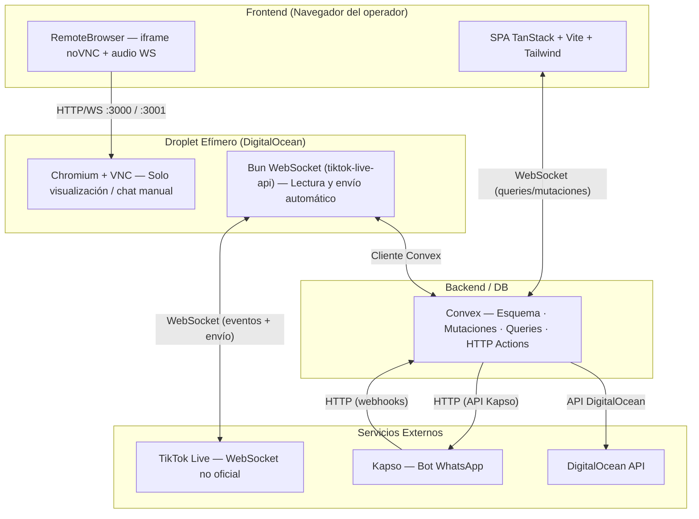
```mermaid
graph TD
    subgraph "Frontend (Navegador del operador)"
        FE["SPA TanStack + Vite + Tailwind"]
        RB["RemoteBrowser — iframe noVNC + audio WS"]
    end

    subgraph "Backend / DB"
        CV["Convex — Esquema · Mutaciones · Queries · HTTP Actions"]
    end

    subgraph "Droplet Efímero (DigitalOcean)"
        CH["Chromium + VNC — Solo visualización / chat manual"]
        IG["Bun WebSocket (tiktok-live-api) — Lectura y envío automático"]
    end

    subgraph "Servicios Externos"
        TK["TikTok Live — WebSocket no oficial"]
        KP["Kapso — Bot WhatsApp"]
        DO["DigitalOcean API"]
    end

    FE <-->|"WebSocket (queries/mutaciones)"| CV
    RB -->|"HTTP/WS :3000 / :3001"| CH
    IG <-->|"WebSocket (eventos + envío)"| TK
    IG <-->|"Cliente Convex"| CV
    KP -->|"HTTP (webhooks)"| CV
    CV -->|"HTTP (API Kapso)"| KP
    CV -->|"API DigitalOcean"| DO
```

> **Nota:** El navegador remoto (Chromium) es solo para visualización y chat manual del operador. El ingestor Bun envía mensajes automáticos **directamente por WebSocket** sin tocar el navegador.

---

### 2. Registro e inicio de sesión

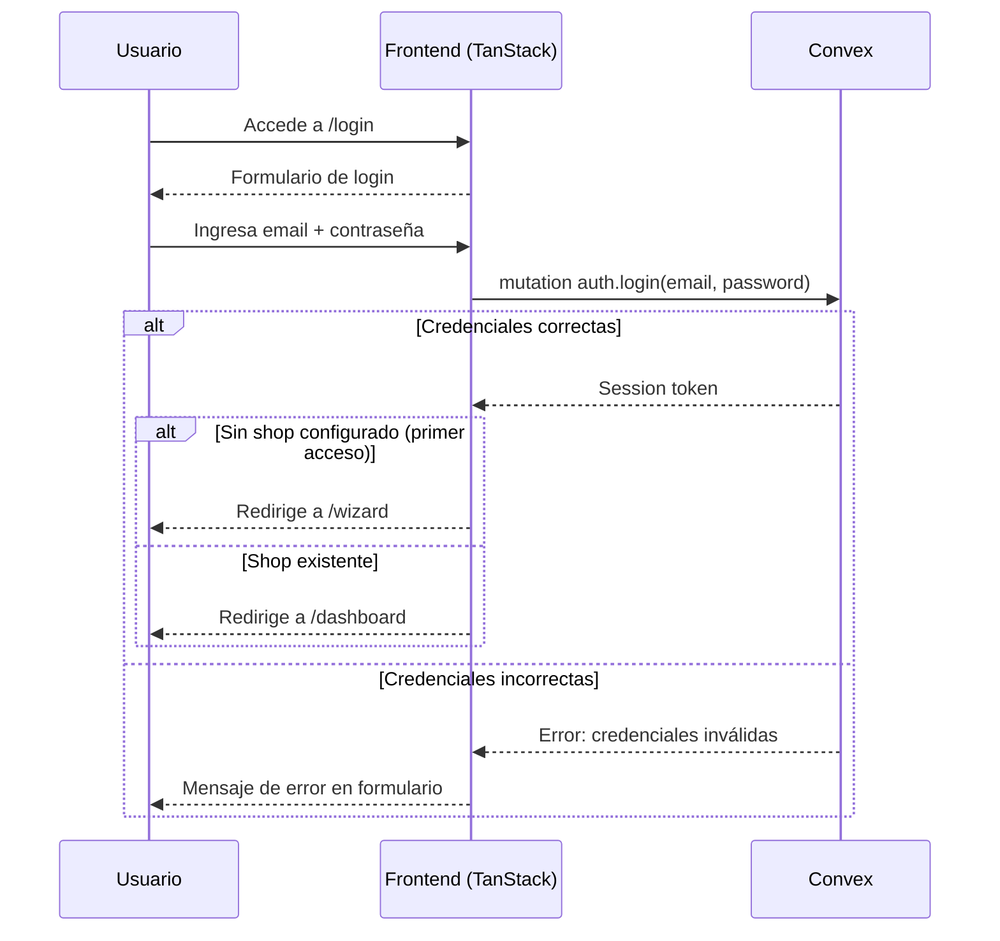
```mermaid
sequenceDiagram
    participant U as Usuario
    participant FE as Frontend (TanStack)
    participant CV as Convex

    U->>FE: Accede a /login
    FE-->>U: Formulario de login
    U->>FE: Ingresa email + contraseña
    FE->>CV: mutation auth.login(email, password)

    alt Credenciales correctas
        CV-->>FE: Session token
        alt Sin shop configurado (primer acceso)
            FE-->>U: Redirige a /wizard
        else Shop existente
            FE-->>U: Redirige a /dashboard
        end
    else Credenciales incorrectas
        CV-->>FE: Error: credenciales inválidas
        FE-->>U: Mensaje de error en formulario
    end
```

---

### 3. Wizard de configuración inicial

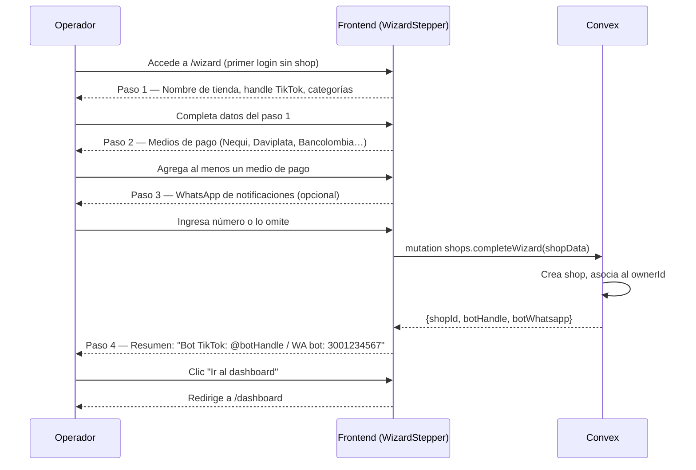
```mermaid
sequenceDiagram
    participant U as Operador
    participant FE as Frontend (WizardStepper)
    participant CV as Convex

    U->>FE: Accede a /wizard (primer login sin shop)
    FE-->>U: Paso 1 — Nombre de tienda, handle TikTok, categorías
    U->>FE: Completa datos del paso 1
    FE-->>U: Paso 2 — Medios de pago (Nequi, Daviplata, Bancolombia…)
    U->>FE: Agrega al menos un medio de pago
    FE-->>U: Paso 3 — WhatsApp de notificaciones (opcional)
    U->>FE: Ingresa número o lo omite
    FE->>CV: mutation shops.completeWizard(shopData)
    CV->>CV: Crea shop, asocia al ownerId
    CV-->>FE: {shopId, botHandle, botWhatsapp}
    FE-->>U: Paso 4 — Resumen: "Bot TikTok: @botHandle / WA bot: 3001234567"
    U->>FE: Clic "Ir al dashboard"
    FE-->>U: Redirige a /dashboard
```

---

### 4. Dashboard inicial y métricas

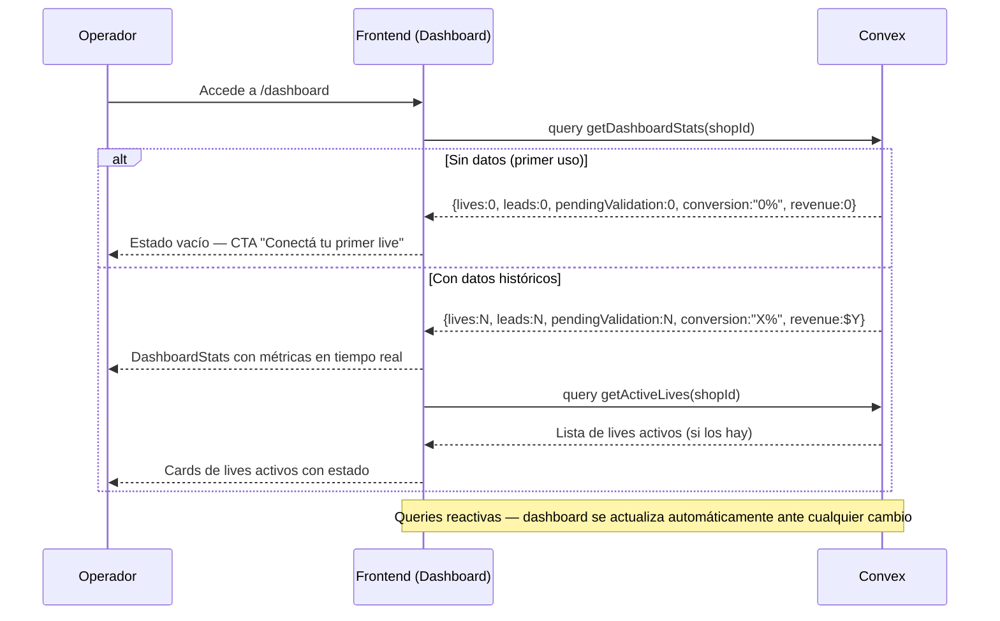
```mermaid
sequenceDiagram
    participant U as Operador
    participant FE as Frontend (Dashboard)
    participant CV as Convex

    U->>FE: Accede a /dashboard
    FE->>CV: query getDashboardStats(shopId)

    alt Sin datos (primer uso)
        CV-->>FE: {lives:0, leads:0, pendingValidation:0, conversion:"0%", revenue:0}
        FE-->>U: Estado vacío — CTA "Conectá tu primer live"
    else Con datos históricos
        CV-->>FE: {lives:N, leads:N, pendingValidation:N, conversion:"X%", revenue:$Y}
        FE-->>U: DashboardStats con métricas en tiempo real
        FE->>CV: query getActiveLives(shopId)
        CV-->>FE: Lista de lives activos (si los hay)
        FE-->>U: Cards de lives activos con estado
    end

    Note over FE,CV: Queries reactivas — dashboard se actualiza automáticamente ante cualquier cambio
```

---

### 5. Conexión a un live de TikTok

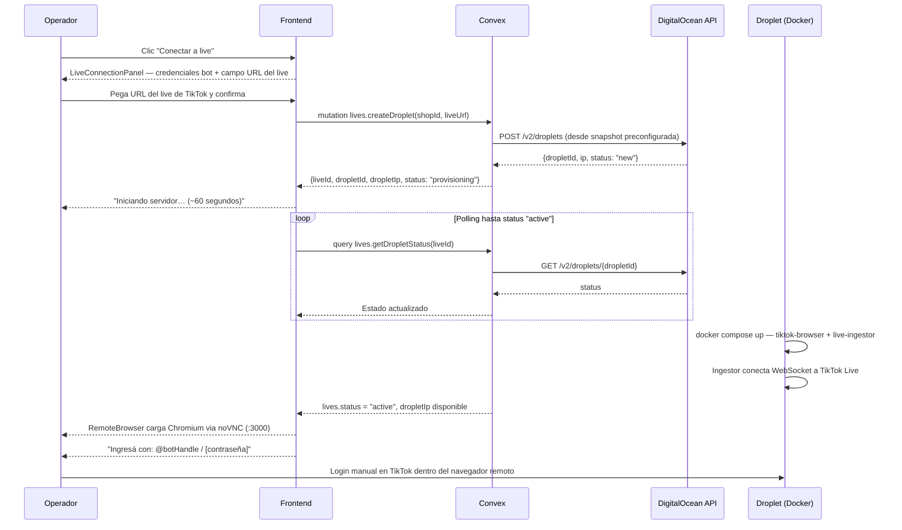
```mermaid
sequenceDiagram
    participant U as Operador
    participant FE as Frontend
    participant CV as Convex
    participant DO as DigitalOcean API
    participant DP as Droplet (Docker)

    U->>FE: Clic "Conectar a live"
    FE-->>U: LiveConnectionPanel — credenciales bot + campo URL del live
    U->>FE: Pega URL del live de TikTok y confirma
    FE->>CV: mutation lives.createDroplet(shopId, liveUrl)
    CV->>DO: POST /v2/droplets (desde snapshot preconfigurada)
    DO-->>CV: {dropletId, ip, status: "new"}
    CV-->>FE: {liveId, dropletId, dropletIp, status: "provisioning"}
    FE-->>U: "Iniciando servidor… (~60 segundos)"

    loop Polling hasta status "active"
        FE->>CV: query lives.getDropletStatus(liveId)
        CV->>DO: GET /v2/droplets/{dropletId}
        DO-->>CV: status
        CV-->>FE: Estado actualizado
    end

    DP->>DP: docker compose up — tiktok-browser + live-ingestor
    DP->>DP: Ingestor conecta WebSocket a TikTok Live
    CV-->>FE: lives.status = "active", dropletIp disponible
    FE-->>U: RemoteBrowser carga Chromium via noVNC (:3000)
    FE-->>U: "Ingresá con: @botHandle / [contraseña]"
    U->>DP: Login manual en TikTok dentro del navegador remoto
```

---

### 6. Captura de lead desde chat del live (verificación de cliente existente)

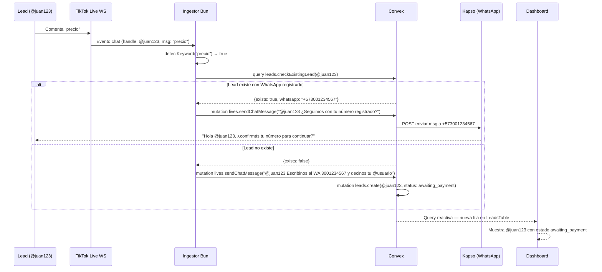
```mermaid
sequenceDiagram
    participant Lead as Lead (@juan123)
    participant TK as TikTok Live WS
    participant IG as Ingestor Bun
    participant CV as Convex
    participant KP as Kapso (WhatsApp)
    participant FE as Dashboard

    Lead->>TK: Comenta "precio"
    TK->>IG: Evento chat (handle: @juan123, msg: "precio")
    IG->>IG: detectKeyword("precio") → true
    IG->>CV: query leads.checkExistingLead(@juan123)

    alt Lead existe con WhatsApp registrado
        CV-->>IG: {exists: true, whatsapp: "+573001234567"}
        IG->>CV: mutation lives.sendChatMessage("@juan123 ¿Seguimos con tu número registrado?")
        CV->>KP: POST enviar msg a +573001234567
        KP-->>Lead: "Hola @juan123, ¿confirmás tu número para continuar?"
    else Lead no existe
        CV-->>IG: {exists: false}
        IG->>CV: mutation lives.sendChatMessage("@juan123 Escribinos al WA 3001234567 y decinos tu @usuario")
        CV->>CV: mutation leads.create(@juan123, status: awaiting_payment)
    end

    CV-->>FE: Query reactiva — nueva fila en LeadsTable
    FE-->>FE: Muestra @juan123 con estado awaiting_payment
```

---

### 7. Recepción de mensaje en WhatsApp y envío de comprobante

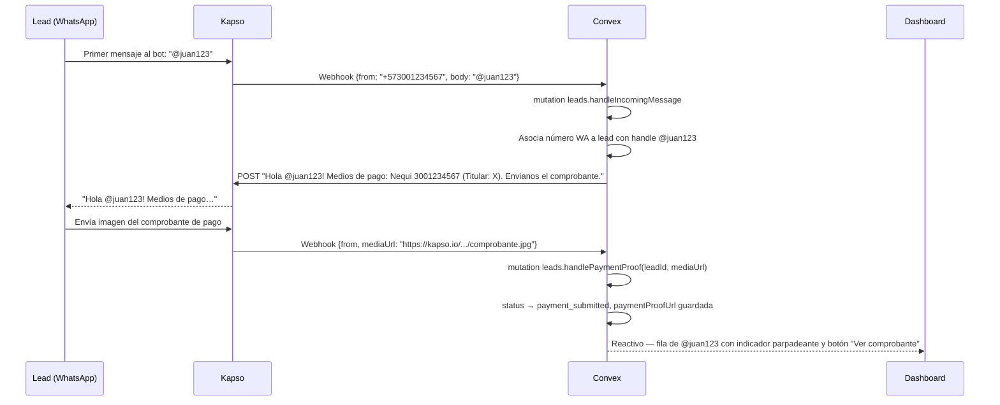
```mermaid
sequenceDiagram
    participant Lead as Lead (WhatsApp)
    participant KP as Kapso
    participant CV as Convex
    participant FE as Dashboard

    Lead->>KP: Primer mensaje al bot: "@juan123"
    KP->>CV: Webhook {from: "+573001234567", body: "@juan123"}
    CV->>CV: mutation leads.handleIncomingMessage
    CV->>CV: Asocia número WA a lead con handle @juan123
    CV->>KP: POST "Hola @juan123! Medios de pago: Nequi 3001234567 (Titular: X). Envianos el comprobante."
    KP-->>Lead: "Hola @juan123! Medios de pago…"

    Lead->>KP: Envía imagen del comprobante de pago
    KP->>CV: Webhook {from, mediaUrl: "https://kapso.io/.../comprobante.jpg"}
    CV->>CV: mutation leads.handlePaymentProof(leadId, mediaUrl)
    CV->>CV: status → payment_submitted, paymentProofUrl guardada
    CV-->>FE: Reactivo — fila de @juan123 con indicador parpadeante y botón "Ver comprobante"
```

---

### 8. Validación de pago por el operador

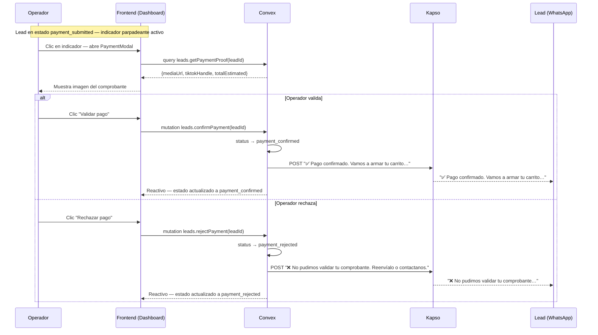
```mermaid
sequenceDiagram
    participant U as Operador
    participant FE as Frontend (Dashboard)
    participant CV as Convex
    participant KP as Kapso
    participant Lead as Lead (WhatsApp)

    Note over FE,U: Lead en estado payment_submitted — indicador parpadeante activo

    U->>FE: Clic en indicador — abre PaymentModal
    FE->>CV: query leads.getPaymentProof(leadId)
    CV-->>FE: {mediaUrl, tiktokHandle, totalEstimated}
    FE-->>U: Muestra imagen del comprobante

    alt Operador valida
        U->>FE: Clic "Validar pago"
        FE->>CV: mutation leads.confirmPayment(leadId)
        CV->>CV: status → payment_confirmed
        CV->>KP: POST "✅ Pago confirmado. Vamos a armar tu carrito…"
        KP-->>Lead: "✅ Pago confirmado. Vamos a armar tu carrito…"
        CV-->>FE: Reactivo — estado actualizado a payment_confirmed
    else Operador rechaza
        U->>FE: Clic "Rechazar pago"
        FE->>CV: mutation leads.rejectPayment(leadId)
        CV->>CV: status → payment_rejected
        CV->>KP: POST "❌ No pudimos validar tu comprobante. Reenvíalo o contactanos."
        KP-->>Lead: "❌ No pudimos validar tu comprobante…"
        CV-->>FE: Reactivo — estado actualizado a payment_rejected
    end
```

---

### 9. Flujo de carrito vía WhatsApp

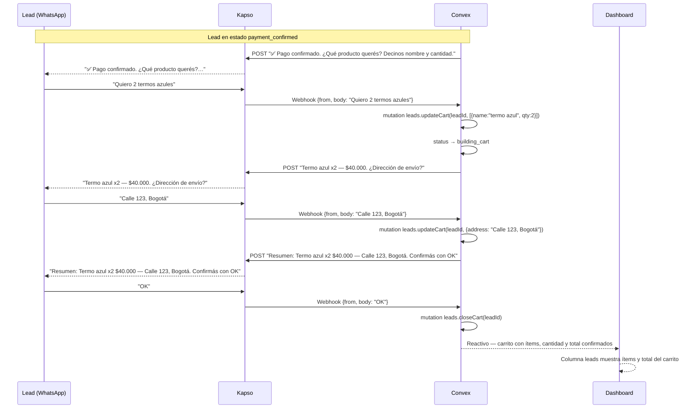
```mermaid
sequenceDiagram
    participant Lead as Lead (WhatsApp)
    participant KP as Kapso
    participant CV as Convex
    participant FE as Dashboard

    Note over Lead,CV: Lead en estado payment_confirmed

    CV->>KP: POST "✅ Pago confirmado. ¿Qué producto querés? Decinos nombre y cantidad."
    KP-->>Lead: "✅ Pago confirmado. ¿Qué producto querés?…"
    Lead->>KP: "Quiero 2 termos azules"
    KP->>CV: Webhook {from, body: "Quiero 2 termos azules"}
    CV->>CV: mutation leads.updateCart(leadId, [{name:"termo azul", qty:2}])
    CV->>CV: status → building_cart
    CV->>KP: POST "Termo azul x2 — $40.000. ¿Dirección de envío?"
    KP-->>Lead: "Termo azul x2 — $40.000. ¿Dirección de envío?"
    Lead->>KP: "Calle 123, Bogotá"
    KP->>CV: Webhook {from, body: "Calle 123, Bogotá"}
    CV->>CV: mutation leads.updateCart(leadId, {address: "Calle 123, Bogotá"})
    CV->>KP: POST "Resumen: Termo azul x2 $40.000 — Calle 123, Bogotá. Confirmás con OK"
    KP-->>Lead: "Resumen: Termo azul x2 $40.000 — Calle 123, Bogotá. Confirmás con OK"
    Lead->>KP: "OK"
    KP->>CV: Webhook {from, body: "OK"}
    CV->>CV: mutation leads.closeCart(leadId)
    CV-->>FE: Reactivo — carrito con ítems, cantidad y total confirmados
    FE-->>FE: Columna leads muestra ítems y total del carrito
```

---

### 10. Gestión de productos durante el live (drag & drop)

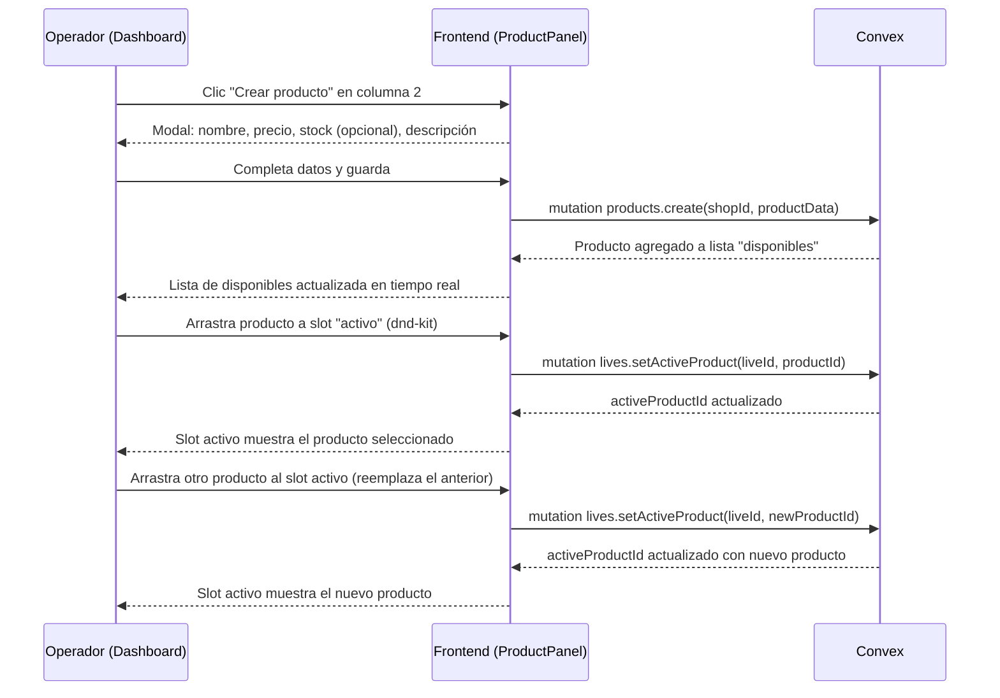
```mermaid
sequenceDiagram
    participant U as Operador (Dashboard)
    participant FE as Frontend (ProductPanel)
    participant CV as Convex

    U->>FE: Clic "Crear producto" en columna 2
    FE-->>U: Modal: nombre, precio, stock (opcional), descripción
    U->>FE: Completa datos y guarda
    FE->>CV: mutation products.create(shopId, productData)
    CV-->>FE: Producto agregado a lista "disponibles"
    FE-->>U: Lista de disponibles actualizada en tiempo real

    U->>FE: Arrastra producto a slot "activo" (dnd-kit)
    FE->>CV: mutation lives.setActiveProduct(liveId, productId)
    CV-->>FE: activeProductId actualizado
    FE-->>U: Slot activo muestra el producto seleccionado

    U->>FE: Arrastra otro producto al slot activo (reemplaza el anterior)
    FE->>CV: mutation lives.setActiveProduct(liveId, newProductId)
    CV-->>FE: activeProductId actualizado con nuevo producto
    FE-->>U: Slot activo muestra el nuevo producto
```

---

### 11. Cierre de live y reseteo (destrucción de droplet)

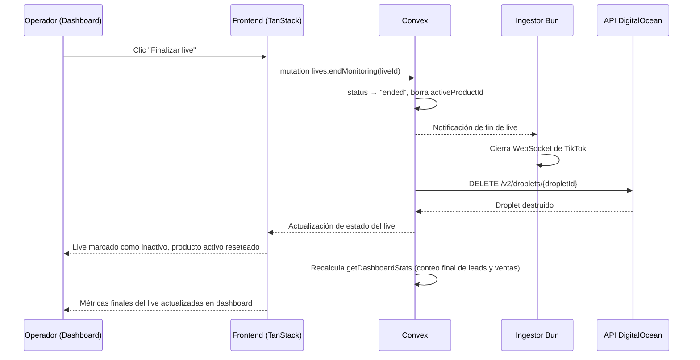
```mermaid
sequenceDiagram
    participant U as Operador (Dashboard)
    participant FE as Frontend (TanStack)
    participant CV as Convex
    participant IG as Ingestor Bun
    participant DO as API DigitalOcean

    U->>FE: Clic "Finalizar live"
    FE->>CV: mutation lives.endMonitoring(liveId)
    CV->>CV: status → "ended", borra activeProductId
    CV-->>IG: Notificación de fin de live
    IG->>IG: Cierra WebSocket de TikTok
    CV->>DO: DELETE /v2/droplets/{dropletId}
    DO-->>CV: Droplet destruido
    CV-->>FE: Actualización de estado del live
    FE-->>U: Live marcado como inactivo, producto activo reseteado
    CV->>CV: Recalcula getDashboardStats (conteo final de leads y ventas)
    FE-->>U: Métricas finales del live actualizadas en dashboard
```

---

### 12. Reconexión del WebSocket de TikTok

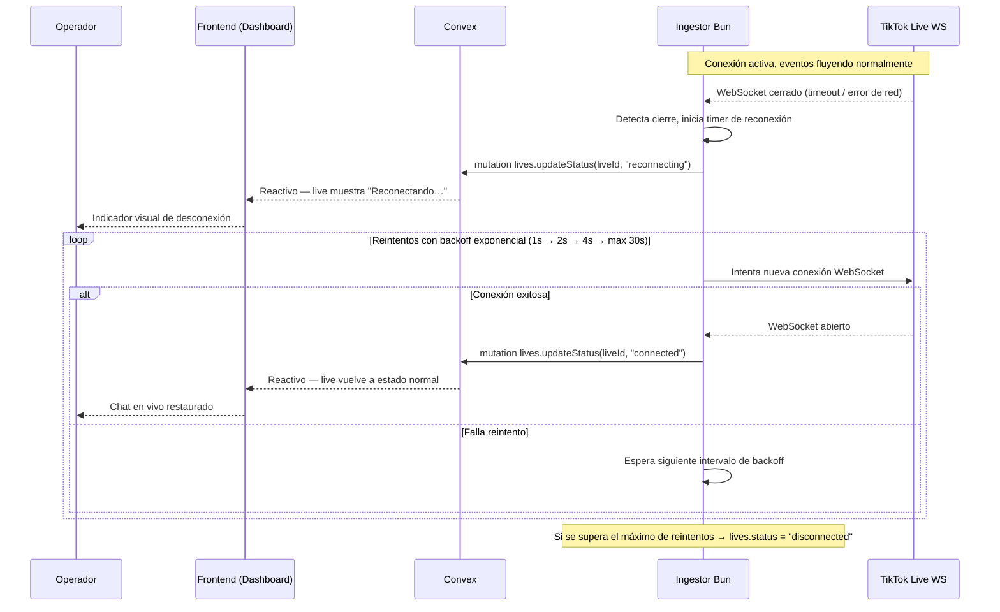
```mermaid
sequenceDiagram
    participant U as Operador
    participant FE as Frontend (Dashboard)
    participant CV as Convex
    participant IG as Ingestor Bun
    participant TK as TikTok Live WS

    Note over IG,TK: Conexión activa, eventos fluyendo normalmente

    TK-->>IG: WebSocket cerrado (timeout / error de red)
    IG->>IG: Detecta cierre, inicia timer de reconexión
    IG->>CV: mutation lives.updateStatus(liveId, "reconnecting")
    CV-->>FE: Reactivo — live muestra "Reconectando…"
    FE-->>U: Indicador visual de desconexión

    loop Reintentos con backoff exponencial (1s → 2s → 4s → max 30s)
        IG->>TK: Intenta nueva conexión WebSocket
        alt Conexión exitosa
            TK-->>IG: WebSocket abierto
            IG->>CV: mutation lives.updateStatus(liveId, "connected")
            CV-->>FE: Reactivo — live vuelve a estado normal
            FE-->>U: Chat en vivo restaurado
        else Falla reintento
            IG->>IG: Espera siguiente intervalo de backoff
        end
    end

    Note over IG: Si se supera el máximo de reintentos → lives.status = "disconnected"
```

---

### 13. Cambio de configuración post-wizard (medios de pago)

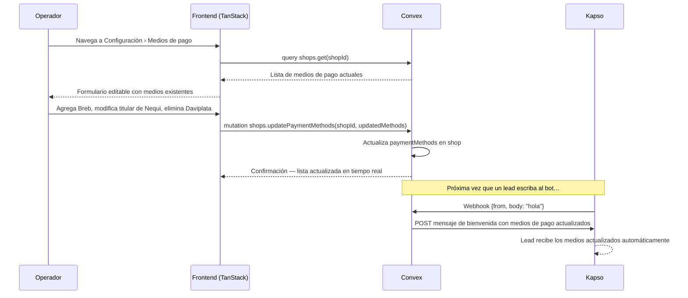
```mermaid
sequenceDiagram
    participant U as Operador
    participant FE as Frontend (TanStack)
    participant CV as Convex
    participant KP as Kapso

    U->>FE: Navega a Configuración › Medios de pago
    FE->>CV: query shops.get(shopId)
    CV-->>FE: Lista de medios de pago actuales
    FE-->>U: Formulario editable con medios existentes

    U->>FE: Agrega Breb, modifica titular de Nequi, elimina Daviplata
    FE->>CV: mutation shops.updatePaymentMethods(shopId, updatedMethods)
    CV->>CV: Actualiza paymentMethods en shop
    CV-->>FE: Confirmación — lista actualizada en tiempo real

    Note over KP,CV: Próxima vez que un lead escriba al bot…
    KP->>CV: Webhook {from, body: "hola"}
    CV->>KP: POST mensaje de bienvenida con medios de pago actualizados
    KP-->>KP: Lead recibe los medios actualizados automáticamente
```

---

### 14. Notificación al vendedor (nuevo comprobante recibido)

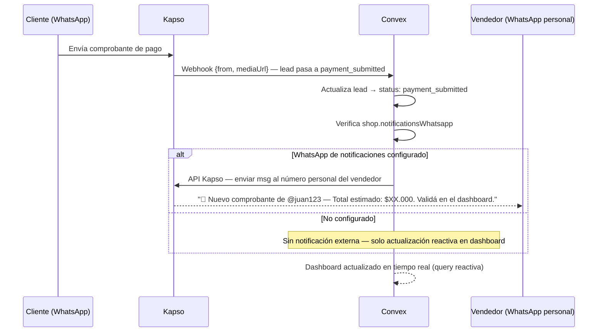
```mermaid
sequenceDiagram
    participant Lead as Cliente (WhatsApp)
    participant KP as Kapso
    participant CV as Convex
    participant VND as Vendedor (WhatsApp personal)

    Lead->>KP: Envía comprobante de pago
    KP->>CV: Webhook {from, mediaUrl} — lead pasa a payment_submitted
    CV->>CV: Actualiza lead → status: payment_submitted
    CV->>CV: Verifica shop.notificationsWhatsapp

    alt WhatsApp de notificaciones configurado
        CV->>KP: API Kapso — enviar msg al número personal del vendedor
        KP-->>VND: "🔔 Nuevo comprobante de @juan123 — Total estimado: $XX.000. Validá en el dashboard."
    else No configurado
        Note over CV: Sin notificación externa — solo actualización reactiva en dashboard
    end

    CV-->>CV: Dashboard actualizado en tiempo real (query reactiva)
```

---

### 15. Cambio de producto activo y notificaciones masivas

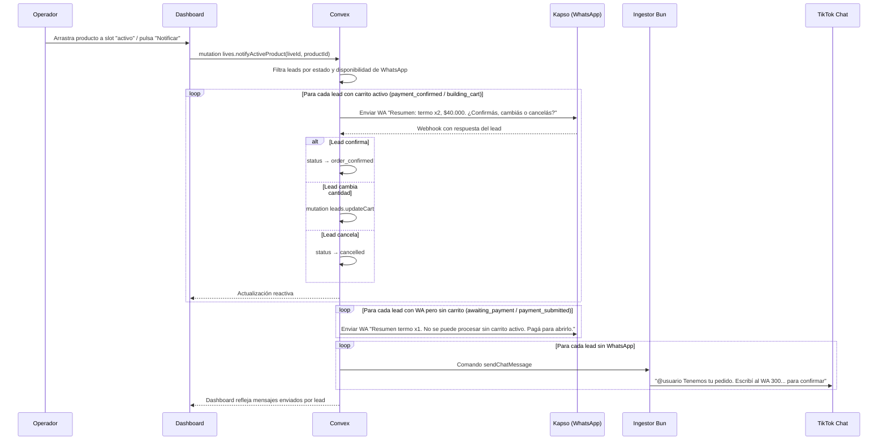
```mermaid
sequenceDiagram
    participant U as Operador
    participant FE as Dashboard
    participant CV as Convex
    participant KP as Kapso (WhatsApp)
    participant IG as Ingestor Bun
    participant TK as TikTok Chat

    U->>FE: Arrastra producto a slot "activo" / pulsa "Notificar"
    FE->>CV: mutation lives.notifyActiveProduct(liveId, productId)
    CV->>CV: Filtra leads por estado y disponibilidad de WhatsApp

    loop Para cada lead con carrito activo (payment_confirmed / building_cart)
        CV->>KP: Enviar WA "Resumen: termo x2, $40.000. ¿Confirmás, cambiás o cancelás?"
        KP-->>CV: Webhook con respuesta del lead
        alt Lead confirma
            CV->>CV: status → order_confirmed
        else Lead cambia cantidad
            CV->>CV: mutation leads.updateCart
        else Lead cancela
            CV->>CV: status → cancelled
        end
        CV-->>FE: Actualización reactiva
    end

    loop Para cada lead con WA pero sin carrito (awaiting_payment / payment_submitted)
        CV->>KP: Enviar WA "Resumen termo x1. No se puede procesar sin carrito activo. Pagá para abrirlo."
    end

    loop Para cada lead sin WhatsApp
        CV->>IG: Comando sendChatMessage
        IG->>TK: "@usuario Tenemos tu pedido. Escribí al WA 300... para confirmar"
    end

    CV-->>FE: Dashboard refleja mensajes enviados por lead
```

---

### 16. Cierre de pedidos al finalizar el live

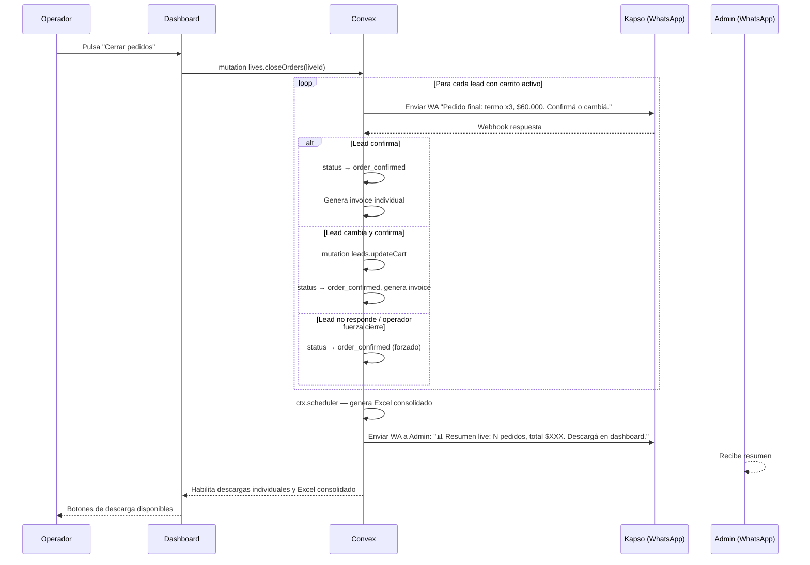
```mermaid
sequenceDiagram
    participant U as Operador
    participant FE as Dashboard
    participant CV as Convex
    participant KP as Kapso (WhatsApp)
    participant Admin as Admin (WhatsApp)

    U->>FE: Pulsa "Cerrar pedidos"
    FE->>CV: mutation lives.closeOrders(liveId)

    loop Para cada lead con carrito activo
        CV->>KP: Enviar WA "Pedido final: termo x3, $60.000. Confirmá o cambiá."
        KP-->>CV: Webhook respuesta

        alt Lead confirma
            CV->>CV: status → order_confirmed
            CV->>CV: Genera invoice individual
        else Lead cambia y confirma
            CV->>CV: mutation leads.updateCart
            CV->>CV: status → order_confirmed, genera invoice
        else Lead no responde / operador fuerza cierre
            CV->>CV: status → order_confirmed (forzado)
        end
    end

    CV->>CV: ctx.scheduler — genera Excel consolidado
    CV->>KP: Enviar WA a Admin: "📊 Resumen live: N pedidos, total $XXX. Descargá en dashboard."
    Admin-->>Admin: Recibe resumen
    CV-->>FE: Habilita descargas individuales y Excel consolidado
    FE-->>U: Botones de descarga disponibles
```

---

### 17. Seguimiento post-live

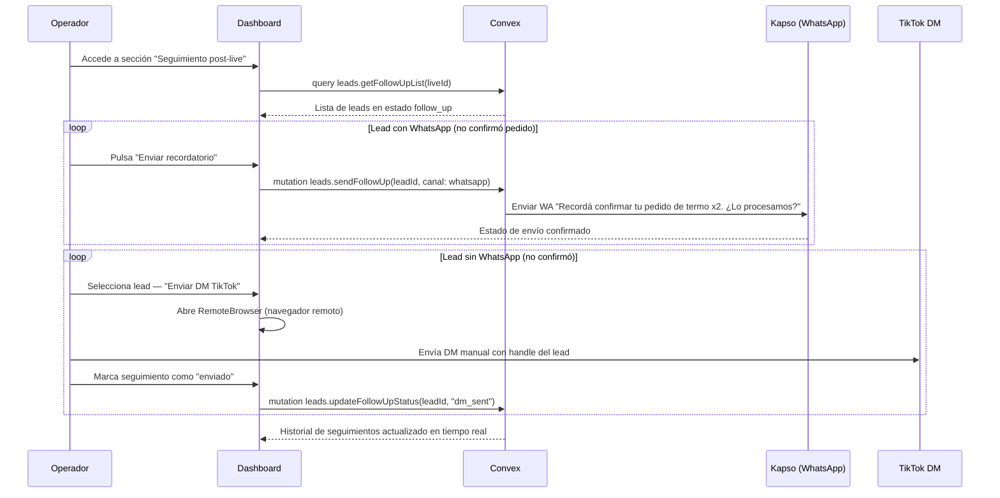
```mermaid
sequenceDiagram
    participant U as Operador
    participant FE as Dashboard
    participant CV as Convex
    participant KP as Kapso (WhatsApp)
    participant TK as TikTok DM

    U->>FE: Accede a sección "Seguimiento post-live"
    FE->>CV: query leads.getFollowUpList(liveId)
    CV-->>FE: Lista de leads en estado follow_up

    loop Lead con WhatsApp (no confirmó pedido)
        U->>FE: Pulsa "Enviar recordatorio"
        FE->>CV: mutation leads.sendFollowUp(leadId, canal: whatsapp)
        CV->>KP: Enviar WA "Recordá confirmar tu pedido de termo x2. ¿Lo procesamos?"
        KP-->>FE: Estado de envío confirmado
    end

    loop Lead sin WhatsApp (no confirmó)
        U->>FE: Selecciona lead — "Enviar DM TikTok"
        FE->>FE: Abre RemoteBrowser (navegador remoto)
        U->>TK: Envía DM manual con handle del lead
        U->>FE: Marca seguimiento como "enviado"
        FE->>CV: mutation leads.updateFollowUpStatus(leadId, "dm_sent")
    end

    CV-->>FE: Historial de seguimientos actualizado en tiempo real
```

---

### 18. Máquina de estados del lead

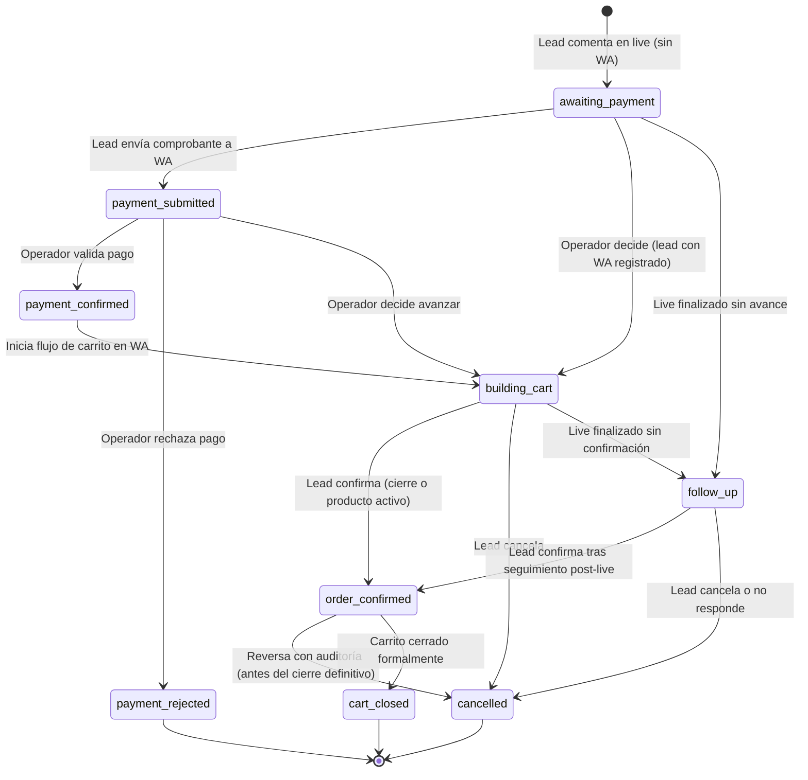
```mermaid
stateDiagram-v2
    [*] --> awaiting_payment : Lead comenta en live (sin WA)

    awaiting_payment --> payment_submitted : Lead envía comprobante a WA
    awaiting_payment --> building_cart : Operador decide (lead con WA registrado)
    awaiting_payment --> follow_up : Live finalizado sin avance

    payment_submitted --> payment_confirmed : Operador valida pago
    payment_submitted --> payment_rejected : Operador rechaza pago
    payment_submitted --> building_cart : Operador decide avanzar

    payment_confirmed --> building_cart : Inicia flujo de carrito en WA
    payment_rejected --> [*]

    building_cart --> order_confirmed : Lead confirma (cierre o producto activo)
    building_cart --> cancelled : Lead cancela
    building_cart --> follow_up : Live finalizado sin confirmación

    order_confirmed --> cancelled : Reversa con auditoría (antes del cierre definitivo)
    order_confirmed --> cart_closed : Carrito cerrado formalmente

    cart_closed --> [*]
    follow_up --> order_confirmed : Lead confirma tras seguimiento post-live
    follow_up --> cancelled : Lead cancela o no responde
    cancelled --> [*]
```

---

### 19. Arquitectura de Multitenancy

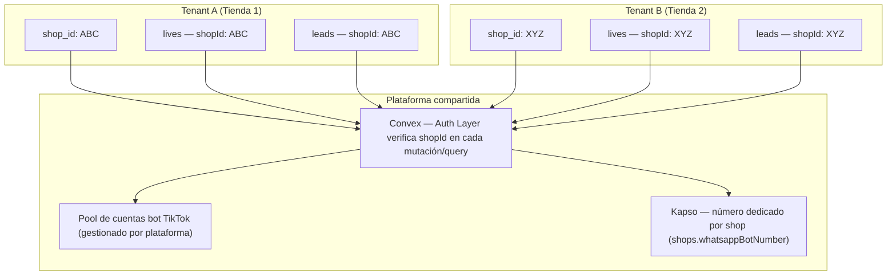
```mermaid
graph TD
    subgraph "Tenant A (Tienda 1)"
        S1["shop_id: ABC"]
        L1["lives — shopId: ABC"]
        LD1["leads — shopId: ABC"]
    end

    subgraph "Tenant B (Tienda 2)"
        S2["shop_id: XYZ"]
        L2["lives — shopId: XYZ"]
        LD2["leads — shopId: XYZ"]
    end

    subgraph "Plataforma compartida"
        CV["Convex — Auth Layer verifica shopId en cada mutación/query"]
        POOL["Pool de cuentas bot TikTok (gestionado por plataforma)"]
        KP["Kapso — número dedicado por shop (shops.whatsappBotNumber)"]
    end

    S1 --> CV
    S2 --> CV
    CV --> POOL
    CV --> KP
    L1 --> CV
    LD1 --> CV
    L2 --> CV
    LD2 --> CV
```

**Principios de aislamiento multitenant:**

- Todas las tablas relevantes (`lives`, `leads`, `products`, `invoices`) incluyen `shopId`.
- Cada mutación/query de Convex obtiene el `shopId` del `ctx.auth` y filtra explícitamente.
- Los droplets son efímeros y pertenecen a un único `liveId` → `shopId`.
- Cada tienda recibe un número de WhatsApp Bot dedicado en Kapso (`shops.whatsappBotNumber`).
- El pool de cuentas bot TikTok es gestionado internamente por la plataforma; los tenants no acceden entre sí.

---

## Consideraciones de Arquitectura — Componentes detallados

### 2.1 Frontend — SPA TanStack

**Tecnologías:** Vite · React · TanStack Router · Tailwind CSS · Vitest · dnd-kit

**Responsabilidades:**
- Renderizar el dashboard del operador con métricas en tiempo real.
- Proporcionar la interfaz de 3 columnas del live: navegador remoto, productos y leads.
- Gestionar wizard de configuración inicial y secciones de Configuración, Productos y Clientes.
- Comunicarse **exclusivamente** con Convex mediante queries y mutaciones reactivas.
- Componente `RemoteBrowser`: embebe el escritorio remoto vía noVNC (iframe a `:3000`) y recibe audio por WebSocket (`:3001`).

**Interfaces:**
- Convex Client SDK (WebSocket autogestionado)
- `http://<droplet-ip>:3000/vnc.html` (noVNC)
- `ws://<droplet-ip>:3001` (audio)

### 2.2 Backend / Base de datos — Convex

**Tecnologías:** Convex (serverless) · TypeScript · convex-test

**Responsabilidades:**
- Esquema de BD con tablas: `users`, `shops`, `products`, `lives`, `leads`, `paymentConfirmations`, `invoices`.
- Toda la lógica de negocio en mutaciones (transacciones atómicas) y queries reactivas.
- Recibir webhooks de Kapso vía HTTP Actions.
- Llamar a la API de DigitalOcean para crear/destruir droplets.
- Enviar comandos a Kapso (mensajes proactivos, flujos de carrito).
- Generar facturas y Excel consolidado vía `ctx.scheduler`.

**Seguridad:**
- Mutaciones validan permisos con `ctx.auth`.
- Webhooks de Kapso incluyen secreto compartido.
- Credenciales del bot TikTok **no se almacenan** en Convex; se inyectan en el droplet como vars de entorno.

### 2.3 Droplet efímero (DigitalOcean)

Cada live activo despliega un droplet desde snapshot preconfigurada. Ejecuta dos contenedores vía `docker compose up`.

**Contenedor `tiktok-browser`:**

| Servicio | Propósito |
|---------|-----------|
| Xvfb | Framebuffer virtual (pantalla) |
| fluxbox | Gestor de ventanas ligero |
| x11vnc | Servidor VNC que comparte el escritorio X11 |
| websockify | Puente WebSocket ↔ TCP para noVNC |
| PulseAudio | Servidor de sonido virtual |
| ffmpeg | Captura de audio del sistema y codificación PCM |
| audio-server.js | Servidor Node.js que sirve la página combinada + audio WS |
| Chromium | Navegador real que carga TikTok Live |

Puertos expuestos: `:3000` (noVNC via websockify) · `:3001` (página combinada + audio WebSocket)

**Contenedor `live-ingestor` (Bun):**

- Se conecta al chat de TikTok via WebSocket usando `tiktok-live-api`.
- Detecta palabras clave de intención de compra.
- Consulta Convex para verificar clientes existentes.
- Envía mensajes automáticos al chat vía WebSocket (sin tocar el navegador).
- Aplica rate limiting para evitar bans.
- Implementa reconexión automática con backoff exponencial.

### 2.4 Kapso (WhatsApp Bot)

- **Número dedicado por tienda** almacenado en `shops.whatsappBotNumber`.
- Flujos conversacionales configurados para: bienvenida, medios de pago, recepción de comprobante, flujo de carrito, confirmación de pedido, recordatorio post-live.
- Webhooks HTTP → Convex HTTP Actions para todos los eventos entrantes.
- Convex llama a la API de Kapso para mensajes proactivos.

### 2.5 Infraestructura (DigitalOcean)

- La snapshot preconfigurada incluye ambos contenedores Docker listos para `docker compose up`.
- Las credenciales del TikTok Bot y el `liveId` + `shopId` se inyectan como variables de entorno al crear el droplet.
- Destrucción automática al finalizar el live o por timeout de inactividad.
- Límite de droplets por shop para controlar costos (configurable en `tenantLimits`).

---

## Evolución prevista (post-MVP)

1. **Pool de droplets precalentados:** reducir latencia de inicio manteniendo droplets en standby.
2. **Migración a WhatsApp Cloud API:** si Kapso no soporta flujos interactivos complejos.
3. **Cuentas bot de TikTok dedicadas por tienda:** mayor aislamiento y menor riesgo de bloqueo global.
4. **Dashboard de monitoreo centralizado:** logs agregados, alertas de desconexión.
5. **Exportación a almacén externo:** para reporting avanzado sin depender de Convex.

---

---

# Anexo — Historial de refinamiento

> Este anexo no forma parte del SDD Briefing. Documenta el proceso iterativo de consultas, ajustes y decisiones que llevaron al documento final.

**Proyecto:** Live Commerce Automation MVP  
**Documento asociado:** Pre-Execution SDD Briefing v5  
**Fecha:** 8 de junio de 2026

---

## Resumen del proceso

La construcción del SDD Briefing fue un proceso iterativo que abarcó desde la investigación técnica inicial hasta la definición detallada de flujos de negocio, arquitectura y casos de borde.

---

## Iteraciones

### 1. Investigación técnica inicial
**Consulta:** Research técnico sobre approaches para automatizar la transición de un cliente desde un live de TikTok hacia un canal privado en WhatsApp. Evaluación de Kapso, tiktok-live-api, Convex, TanStack, Bun y Turborepo.

**Respuesta:** Se entregó un análisis con tres approaches (reply en chat, DM automático, landing intersticial), tradeoffs del stack propuesto, riesgos de producción (overselling, micro-batching) y alternativas. Se recomendó el reply automático en el chat usando `tiktok-live-api`.

---

### 2. Definición del stack tecnológico y tradeoffs
**Consulta:** Evaluar el stack completo, analizar performance, overselling, limitaciones y mejoras.

**Respuesta:** Se detallaron ventajas y desventajas de cada herramienta. Se identificó la inestabilidad de la API no oficial de TikTok (riesgo de ban) y la necesidad de micro-batching en el ingestor. Se recomendó Convex para transacciones atómicas.

---

### 3. Primera propuesta de flujo con número del anfitrión
**Consulta:** El usuario describió la dinámica real: el anfitrión muestra su número de WhatsApp en pantalla, recibe comprobantes y valida manualmente. Propuso un dashboard con validación manual y derivación a canal privado.

**Respuesta:** Se analizó la viabilidad de dos números (público del anfitrión y privado del bot). Se identificó que el número del anfitrión no puede usarse simultáneamente en la App y la API de WhatsApp (conflicto App/API).

---

### 4. Unificación en un solo número de WhatsApp (bot)
**Consulta:** El usuario planteó usar solo el número del bot, mostrado en pantalla, y que todo el flujo ocurra en ese canal.

**Respuesta:** Se ajustó el flujo para un único número de Kapso. El bot envía medios de pago, recibe comprobantes, notifica al dashboard para validación y continúa el flujo de carrito en el mismo chat.

---

### 5. Definición del wizard, dashboard y vista de live en 3 columnas
**Consulta:** El usuario describió los flujos detallados: login, wizard, dashboard con métricas, y vista de live en 3 columnas (chat, productos, leads).

**Respuesta:** Se estructuró el SDD con estos flujos. Se señalaron puntos faltantes: credenciales de TikTok del bot, mecanismo de conexión a un live, asociación TikTok-WhatsApp, y webhooks de Kapso para reflejar el carrito. Se propuso dnd-kit para drag & drop y una máquina de estados para leads.

---

### 6. Corrección: el bot lo provee la plataforma
**Consulta:** El usuario aclaró que el wizard no debe pedir credenciales del TikTok Bot, porque la plataforma los provee. Solo debe notificarse el @usuario del bot al finalizar el wizard.

**Respuesta:** Se eliminó el paso de ingreso de credenciales del wizard. El sistema muestra las credenciales (fijas) al finalizar el wizard y en la pantalla de conexión. La cuenta bot es interna de la plataforma.

---

### 7. Adopción de Strict TDD
**Consulta:** El usuario cuestionó por qué no se aplicó Strict TDD en el briefing inicial, siendo que la metodología lo exige si hay infraestructura de testing.

**Respuesta:** Se reconoció la omisión. Se actualizó el SDD para incluir T0 (configuración de testing con Vitest + convex-test + Bun test runner) y se activó Strict TDD en todas las tareas (RED → GREEN → TRIANGULATE → REFACTOR).

---

### 8. Solución de navegador remoto (Columna 1)
**Consulta:** El usuario explicó que no se puede embeber el chat de TikTok en un iframe (CORS/Clickjacking). Propuso una solución probada: Chromium real dentro de un contenedor Docker, transmitido via noVNC/WebSocket, con Xvfb, fluxbox, x11vnc, websockify, PulseAudio, ffmpeg y audio-server.js. Despliegue como droplets efímeros en DigitalOcean.

**Respuesta:** Se rediseñó la arquitectura para incluir el contenedor `tiktok-browser` y el contenedor `live-ingestor` con Bun. Se añadió orquestación de droplets vía API de DigitalOcean. Se actualizaron diagramas y tareas.

---

### 9. Separación de envío automático (WebSocket) y navegador manual
**Consulta:** El usuario clarificó que los mensajes automáticos del bot NO deben enviarse a través del navegador, sino usando la misma librería `tiktok-live-api` que el ingestor usa para leer el chat. El navegador solo sirve para visualización y chat manual del operador.

**Respuesta:** Se corrigió la arquitectura. El ingestor envía mensajes automáticos vía WebSocket sin tocar el navegador. El navegador es solo una terminal para el operador. Se eliminó la dependencia de Puppeteer/Playwright.

---

### 10. Verificación de cliente existente
**Consulta:** El usuario pidió que, cuando un lead comenta en el live, el sistema valide si ya existe en la BD. Si existe con WhatsApp, se le envía un mensaje para confirmar su número. Si no existe, se le invita a escribir al WhatsApp del bot.

**Respuesta:** Se añadió la función `checkExistingLead` en el ingestor, que consulta Convex antes de crear un lead. El envío condicional (WhatsApp vs chat) se reflejó en el diagrama de secuencia 2.

---

### 11. Flujos de cierre de carrito y notificación por producto activo
**Consulta:** El usuario detalló que al cambiar el producto activo el bot debe notificar a los leads según su estado: (a) con carrito → resumen y confirmación; (b) con WA sin carrito → indica que necesita pago para abrir carrito; (c) sin WA → mensaje en chat.

**Respuesta:** Se añadieron los escenarios 4bis y 5, la mutación `lives.notifyActiveProduct`, la lógica de cierre con generación de factura individual y Excel consolidado. Se actualizó la máquina de estados con `cart_closed` y `follow_up`.

---

### 12. Seguimiento post-live y facturación
**Consulta:** El usuario indicó que tras el cierre hay dos situaciones: leads con pedido sin confirmar (seguimiento por WhatsApp) y leads sin WhatsApp (seguimiento por DM de TikTok). Los pagos los gestiona íntegramente el administrador.

**Respuesta:** Se añadió la sección de seguimiento post-live (R8, Escenario 6, T14), con recordatorios automáticos por WhatsApp y envío manual de DM desde el navegador remoto.

---

### 13. Corrección de errores y refinamiento final
**Consulta:** El usuario reportó un error de parseo en el diagrama de arquitectura Mermaid y un corte en la descarga del Markdown.

**Respuesta:** Se corrigió el diagrama de arquitectura (anidamiento problemático de subgrafos) y se revisó el cierre de bloques de código. Se generó el archivo final completo con el Historial de Refinamiento.

---

## Decisiones clave consolidadas

| Decisión | Alternativas consideradas | Justificación final |
|----------|--------------------------|---------------------|
| Reply en chat de TikTok (no DM) | DM automático, landing intersticial | DM inviable técnicamente; landing agrega fricción innecesaria |
| Un solo número WhatsApp (bot, no anfitrión) | Dos números (anfitrión + bot) | Conflicto App/API del anfitrión; simplifica la experiencia del cliente |
| Envío automático vía WebSocket (no navegador) | Automatizar el navegador con Puppeteer | Más estable, sin dependencia del estado visual del browser; menor riesgo de ban |
| Convex como backend único | Node + Postgres, Supabase, Firebase | Transacciones atómicas nativas, real-time reactivo sin overhead extra |
| Droplet efímero por live | Droplets persistentes, serverless | Aislamiento por sesión, costos controlados, destrucción automática |
| Kapso para WhatsApp | WhatsApp Cloud API directa, Twilio | Menor tiempo de desarrollo; API con flujos visuales; migración contemplada si no escala |
| Strict TDD desde T0 | TDD solo para lógica crítica | La metodología SDD lo exige; la infraestructura de testing fue confirmada |
| Verificación de cliente existente en ingestor | Solo crear siempre un nuevo lead | Evita duplicados y mejora la experiencia de clientes recurrentes |
| Multitenancy con shopId desde el inicio | Agregar multitenancy post-MVP | Costo bajo de implementar desde el diseño vs refactoring posterior |
