# Live Commerce Automation MVP
## Versión 6 — Revisión Electron local

**Proyecto:** Livefy  
**Fecha:** 28 de septiembre de 2026  
**Estado:** propuesta previa a ejecución; no acredita implementación ni validación  
**Idioma:** Castellano

> Este documento es una revisión autónoma de `docs/livefy-scope-mvp_20260925.md`. El nombre del archivo fuente indica 25 de septiembre de 2026, pero su encabezado interno declara 8 de junio de 2026; esta discrepancia de procedencia se conserva explícitamente. La presente revisión está fechada el 28 de septiembre de 2026, conserva los flujos de negocio y reemplaza únicamente la arquitectura de visualización e ingestión: una aplicación Electron ejecuta el navegador y el audio en el equipo del operador, y el ingestor corre localmente. Convex y Kapso siguen siendo servicios remotos.

## Arquitectura obligatoria — Electron primero, web futura

Esta decisión autorizada rige **toda implementación futura**, incluida H1.4 en adelante. No acredita código compartido ni habilita despliegues. El MVP inicial entrega video, productos y eventos en Electron; una versión posterior ofrecerá productos y eventos en navegador responsive, **sin visor de video**. No se restaura noVNC ni se despliega un ingestor cloud ahora.

### Fronteras que deben mantenerse desde el MVP

| Frontera | Regla obligatoria |
|---|---|
| Frontend compartido | Una sola implementación de pantallas, rutas, UI, estado y comportamiento de producto; no duplicar pantallas ni lógica de negocio por plataforma. Convex conserva la autoridad de negocio. |
| Shell y capacidades | Aislar visor, almacenamiento seguro, procesos, permisos y demás capacidades nativas en adaptadores Electron; el frontend compartido MUST NOT importar Electron ni Node. |
| Preload y autenticación | Bootstrap/proveedores y persistencia específicos de plataforma quedan detrás de adaptadores. El bridge es estrecho, tipado, validado y autorizado; no expone IPC genérico ni secretos. |
| Routing | Compartir definiciones de rutas y guards; seleccionar history y bootstrap en la entrada de plataforma. La elección desktop de hash/protocolo no se incorpora como requisito universal de las rutas. |
| Video remoto | Superficie Electron aislada del renderer de producto, sin Node ni bridge privilegiado general. No relajar sandbox, contextIsolation, CSP, navegación ni permisos para reutilizar UI o mostrar video. |
| Ingestor | Ejecutable autónomo, iniciable sin Electron; el supervisor local controla su proceso, no contiene su núcleo. Runtime y empaquetado siguen pendientes. |
| Convex | Autoridad de negocio, persistencia, autorización, idempotencia y leases/epochs. El ingestor normaliza/transfiere eventos y ejecuta comandos autorizados; no replica decisiones comerciales. |

### Contratos y ciclos de vida independientes

- Eventos normalizados, comandos, resultados y salud MUST tener contratos versionados, tipados y validados en la frontera. Deben definir compatibilidad, alcance de identidad/tienda/live/productor, correlación, secuencia/idempotencia, errores y expiración; son contratos internos, no supuestos de API del proveedor.
- **Live comercial:** estado de venta, pedidos y cierre explícito controlados por Convex.
- **Sesión productora:** captura, heartbeat, lease/epoch, reconexión y parada. Al cerrar Electron se detiene el runner **LOCAL** y se revoca/finaliza su sesión; una caída se detecta por timeout y puede dejar brechas.
- **Presencia del visor:** abrir/cerrar video o desconectar un cliente no equivale a terminar el live comercial. “Finalizar live” sí es una acción explícita de negocio y coordina la parada del productor pertinente.
- Un futuro productor cloud sería independiente del cierre del desktop o navegador y requeriría controles explícitos y autorizados de inicio/parada/revocación. No hereda la regla de parada local ni se acepta como operativo en este MVP.

### Meta de reutilización y aceptación por fases

La futura entrega de ambas plataformas MUST alcanzar **≥90% de fuente frontend propia compartida**: líneas de fuente frontend propia usadas por ambos clientes / total de líneas de fuente frontend propia de ambos clientes, contando cada archivo una vez. El denominador incluye frontend específico de plataforma, incluidos adaptadores de autenticación, y excluye dependencias, código generado y shell nativo. La medición debe registrar inventario, clasificación y método reproducible; no se infiere de tipos compartidos ni de bundles. **No existe prueba ni medición actual del porcentaje.**

| Fase | Gate de aceptación, sin numeración nueva de hitos |
|---|---|
| Electron MVP y H1.4+ | Ejecutar primero en Electron y verificar las fronteras anteriores, ausencia de imports nativos en frontend compartido, contratos y separación de ciclos; conservar cada aceptación Windows/H1 pendiente. |
| Extracción/adaptadores | Demostrar que rutas/UI/estado no dependen del bootstrap nativo, que el ingestor arranca autónomo y que contratos compatibles/incompatibles y authz/idempotencia/leases se prueban. Sin duplicar pantallas ni negocio. |
| Navegador futuro | Verificar autenticación web, orígenes, sesiones/logout/revocación, history/deep links/recarga, builds y ausencia de dependencias nativas; validar productos/eventos responsive en móvil sin visor y medir ≥90%. Todo pendiente, no aceptado por evidencia Electron. |
| Operación cloud futura | Autorizar y verificar por separado despliegue, credenciales, supervisión, salud, reconexión/brechas, leases, inicio/parada/revocación, observabilidad y recuperación; demostrar independencia del cliente. Sin promesas de costo ni capacidades de proveedor asumidas. |

**Evidencia y referencias:** [plan de acceso H1](../odd/tasks/mvp-h1-access-windows.md) conserva H1.1–H1.3 y sus límites desktop; esta enmienda no los reabre ni repite. [Tarea de arquitectura](../odd/tasks/electron-first-web-ready.md) delimita la edición documental. [Scope histórico](livefy-scope-mvp_20260925.md) es contexto, no plan activo. Las rutas de paquetes de Design son destinos propuestos, no prueba de extracción realizada.

## Resumen de la revisión

| Sección afectada | Cambio |
|---|---|
| Stack y supuestos | Electron aloja la experiencia local. |
| Proposal y Spec | Se elimina la dependencia operativa de navegador e ingestor cloud por sesión. Se explicitan ciclo de vida local, desconexiones y brechas de captura. |
| Design y seguridad | Se agregan aislamiento de contenido no confiable, IPC validado, protección de sesión, autenticación del ingestor y límites de navegación. |
| Datos | `lives` registra estado y presencia del cliente local, sin campos de infraestructura efímera. |
| Tasks | Se reemplazan aprovisionamiento y navegador remoto por empaquetado Electron, host de contenido y supervisor del ingestor local. |
| Risks y spikes | La lectura/escritura TikTok, Electron con video/audio/login y la compatibilidad del runtime son razones técnicas aún no verificadas con evidencia en este documento; no constituyen aceptación de viabilidad. |
| Diagramas | Se adaptan los 19 diagramas al proceso local y se corrigen cierre, reconexión y seguimiento post-live. |

### Alcance histórico de los términos retirados

La versión anterior proponía DigitalOcean, droplets, snapshots, `RemoteBrowser`, noVNC/VNC, PulseAudio y redirección con ffmpeg. Esos términos describen solamente la arquitectura histórica reemplazada; **no son dependencias activas ni tareas del MVP revisado**.

---

## Stack propuesto

- **Aplicación de escritorio:** Electron + React/TanStack Router + Vite + Shadcn como sistema de diseño (https://ui.shadcn.com).
- **Backend/DB remoto:** Convex.
- **Ingestor local:** ejecutable autónomo supervisado como proceso por Electron; Bun y librería tiktok-live-api propuestos, con runtime/empaquetado pendientes.
- **WhatsApp remoto:** Kapso, para envío proactivo y contexto conversacional.
- **Monorepo:** Turborepo; estrategia de workspaces con Bun Workspaces y Bun como gestor de paquetes.
- **Tests previstos:** Vitest y React Testing Library; `convex-test`; Bun test runner para el runtime del ingestor; pruebas E2E de escritorio por definir.


---

## Assumptions

1. El sistema captura leads desde lives de TikTok y los deriva a WhatsApp para cerrar ventas, con un dashboard para el operador.
2. La plataforma provee la cuenta bot de TikTok y el número de WhatsApp. El operador inicia sesión manualmente en TikTok dentro de la aplicación Electron.
3. El login manual del navegador **no autentica por sí mismo al ingestor**. Para el inicio del ingestor el operador debe proveer el canal del live de tiktok y ejecutar la acción de inicio del ingestor para que se comiencen a escuchar los eventos. 
4. La capacidad de leer eventos y enviar mensajes mediante se basa en tiktok-live-api, La superficie TikTok de Electron se usa para ver el live e interactuar manualmente; el frontend de producto gestiona productos y eventos sin depender del visor.
5. Kapso permanece como proveedor propuesto de WhatsApp; permite webhooks personalizados para reportar eventos de conversación (avance de carrito, confirmación de pedido).
6. El MVP no integra pasarela de pagos. El administrador gestiona y confirma pagos fuera de la automatización; la validación del comprobante es manual.
7. Strict TDD se aplicará durante implementación a lógica de negocio y componentes críticos. Este documento no ejecuta SDD.
8. Convex sigue remoto y es la fuente de verdad de tiendas, lives, leads, productos, carritos, facturas, seguimiento y demas entidades de logica del backend.
9. En este MVP el runner LOCAL captura sólo mientras la aplicación local y su sesión productora estén operativas. Salir, suspender el equipo o perder red detiene o interrumpe captura y envío; no define el ciclo de un futuro productor cloud.
10. El cierre solicitado por el operador debe terminar de forma ordenada; una caída inesperada puede dejar una brecha de eventos imposible de recuperar.
11. Windows es el objetivo de acceso H1; ampliar soporte a otros OS, instaladores, firma/notarización, autoactualización y política de versiones requiere decisión y validación propias.
12. Se elimina la dependencia de cómputo efímero por live, sin prometer ahorro ni costo total. Convex, Kapso, distribución/firma, observabilidad, soporte y cualquier proveedor TikTok requieren evaluación propia.

---

## 1. Proposal

### Problem statement

Los vendedores en lives de TikTok muestran un número de WhatsApp para captar pedidos, el usuario del live escribe y envia el comprobante de pago de abono al WhatsApp para abrir el carrito luego realiza los pedidos por medio de mensajes del live de TikTok. El proceso manual no escala: el anfitrión lee mensajes, valida comprobantes y arma pedidos individualmente. Se necesita automatizar captura de intención, asociación TikTok–WhatsApp, carrito y seguimiento, manteniendo al operador al mando.

Adicionalmente, la visualización del live dentro del dashboard no puede hacerse con un simple iframe por restricciones de TikTok (CORS/Clickjacking). Para resolver la visualización inicial sin un navegador remoto por sesión, se propone Electron con una superficie local aislada. Video, audio, login manual y latencia requieren validación; no se promete ausencia de costos cloud ni de latencia.


### Goals

- Configurar tienda, categorías, medios de pago y notificaciones mediante wizard.
- Proveer un panel de control de escritorio en Electron con una interfaz de 3 columnas: Columna 1 (Live de TikTok con navegador embebido), Columna 2 (Gestión de productos y drag & drop) y Columna 3 (Leads y estados en tiempo real).
- Ofrecer un dashboard TanStack con métricas, video/live local, productos y leads.
- Permitir login e interacción manual con TikTok dentro de una superficie aislada de Electron.
- Automatizar la detección de intenciones de compra en el chat del live de TikTok y el envío de respuestas automáticas (invitación a WhatsApp) usando la misma conexión WebSocket del bot, sin depender del navegador
- Asociar usuarios TikTok con números de WhatsApp.
- Validar comprobantes manualmente y gestionar estados de leads.
- Guiar carrito, confirmaciones y seguimiento mediante Kapso.
- Notificar cambios de producto activo según estado del lead.
- Cerrar pedidos, generar resumen, factura para administrador y consolidado descargable.
- Eliminar la dependencia operativa de cómputo efímero por live, sin garantía de ahorro.
- Recuperarse de desconexiones con backoff y deduplicación, mostrando al operador posibles brechas.

### Non-goals

- Pasarela de pagos integrada o validación automática del comprobante.
- Multi-tenancy avanzado con cuentas de bot separadas por tienda (se diseña desde el principio con shopId pero sin bot dedicado por tienda).
- Aplicación móvil nativa.
- Reportería avanzada fuera del consolidado del live.
- Garantizar cumplimiento de ToS o ausencia de bloqueos en TikTok.
- Automatizar el login del navegador.
- Asumir que cookies de la vista web habilitan el ingestor.
- Garantizar captura mientras la app está cerrada, suspendida u offline.
- Resolver en este documento los sistemas operativos, firma, instalador o actualización.
- Cambiar de Kapso, librería TikTok o backend sin una decisión posterior explícita.

### Affected areas

| Área | Descripción |
|---|---|
| Electron/TanStack | Shell de escritorio, ventana aislada, dashboard, ciclo de vida, permisos y actualizaciones pendientes. |
| Convex | Esquema, authz, sesiones de ingestor, mutaciones, queries, acciones HTTP y webhooks. |
| Ingestor local | Captura/envío TikTok, buffer, deduplicación, backoff, telemetría y cierre ordenado. |
| Kapso | Bot WhatsApp, recepción de media, mensajes proactivos y flujos de carrito. |
| Distribución | Empaquetado por OS, firma/notarización, almacenamiento local protegido y estrategia de updates por decidir. |

### Risks

| # | Riesgo | Prob. | Impacto | Mitigación / gate |
|---|---|---:|---:|---|
| R1 | Proveedor/librería TikTok no permite lectura o envío estable | Alta | Alto | Spike con cuenta de prueba; no prometer automatización antes del go/no-go. |
| R2 | Bloqueo de cuenta por canal no oficial | Alta | Alto | Rate limit, observabilidad, consentimiento y criterio de apagado. |
| R3 | Kapso no conserva contexto o limita mensajes proactivos | Media | Alto | Spike; cualquier cambio de proveedor requiere nueva decisión. |
| R4 | Pérdida de eventos al cerrar, suspender o quedar offline | Alta | Alto | Indicador visible, cierre ordenado, buffer local cifrado si se aprueba, backoff, dedup; aceptar brechas irreparables. |
| R5 | Contenido TikTok compromete privilegios locales | Media | Crítico | Aislamiento web, `nodeIntegration: false`, sandbox, CSP, IPC allowlist validada, permisos y navegación restringidos. |
| R6 | Robo de cookies/sesión local | Media | Alto | Partición dedicada, almacenamiento protegido por OS, no exponer sesión a renderer/IPC/logs. |
| R7 | Suplantación de ingestor o cruce de tenant | Media | Alto | Credencial corta por usuario/tienda/live, authz en Convex y rotación/revocación. |
| R8 | Empaquetado Bun/Node incompatible | Media | Alto | Spike de runtime y artefacto instalable; decisión registrada antes de T6. |
| R9 | Overselling concurrente | Baja | Alto | Mutaciones atómicas e idempotentes con verificación de stock. |
| R10 | Firma/update/OS elevan costo y alcance | Media | Medio | Decisión de producto antes de distribución; no inventar matriz de soporte. |

### Rollback strategy

- Al ser una aplicación de escritorio local, las actualizaciones o reversiones de código se gestionan mediante versionado de la app de Electron y git branches en el monorepo.
- La aplicación debe poder desactivar ingestión automática mediante feature flag sin afectar Convex/Kapso ni la operación manual.
- Las mutaciones Convex serán atómicas e idempotentes; cambios de esquema deberán ser compatibles hacia atrás.
- Los flows de Kapso podrán versionarse/revertirse según capacidades confirmadas del proveedor.
- Una versión de escritorio fallida se retira del canal de distribución; la estrategia concreta depende de la decisión de firma/update.
- Ante fallo local, el seguimiento WhatsApp remoto continúa porque depende de Convex y Kapso, no de que Electron siga abierto.

### Success criteria

1. El vendedor completa el wizard y llega al dashboard con CTA para conectar un live.
2. Tras abrir una sesión, Electron presenta TikTok con video y audio utilizables y permite login manual.
3. El dashboard distingue `connected`, `reconnecting`, `offline`, `suspended-risk`, `disconnected` y `ended`.
4. El ingestor entrega comentarios normalizados; Convex detecta intención de compra y ordena la respuesta del bot en un SLA previamente definido.
5. Con la lectura de la intencion de compra se actualiza el estado de seguimiento de cada lead/usuario.
6. Un webhook válido de Kapso actualiza el lead de forma reactiva dentro del umbral validado.
7. Pago, carrito, producto activo, cierre y facturación conservan el flujo definido.
8. Al cambiar el producto activo, los leads reciben la notificación adecuada según su estado.
9. La parada local detiene capturas, intenta flush acotado y revoca/finaliza la sesión productora; sólo la acción explícita de finalizar live termina el live comercial.
10. Una terminación inesperada se detecta por heartbeat y se informa como posible brecha, sin afirmar recuperación total.
11. El seguimiento WhatsApp post-live funciona aunque la aplicación de escritorio esté cerrada.
12. Las fronteras de seguridad tienen tests y revisión explícita antes de distribuir.

---

## 2. Spec (contrato verificable propuesto)

### Requirements

**R1 – Wizard de configuración**

- MUST capturar nombre de tienda, descripción, categorías y al menos un medio de pago.
- MUST permitir editar esa información luego.
- MUST mostrar el handle bot TikTok y número bot WhatsApp provistos por plataforma.
- SHOULD permitir WhatsApp personal opcional para notificaciones.
- MUST NOT solicitar ni persistir secretos globales del proveedor dentro del instalador.

**R2 – Dashboard inicial**

- MUST mostrar lives activos, leads nuevos, pendientes, conversión y ventas estimadas.
- MUST mostrar estado vacío y CTA si no hay datos.
- MUST obtener `shopId` desde identidad autorizada, nunca confiar en un identificador arbitrario del cliente.

**R3 – Vista de Live (3 columnas)**

**Columna 1 — visor local Electron:**

- MUST mostrar credenciales operativas permitidas y número WhatsApp sin revelar secretos globales.
- MUST abrir TikTok en una partición/superficie aislada con sandbox y Node deshabilitado.
- MUST permitir login manual, video, audio nativo e interacción manual cuando la compatibilidad esté validada.
- MUST limitar navegación, nuevas ventanas, descargas, protocolos y permisos a una política allowlist.
- MUST dejar claro que el login visual no autentica al ingestor.
- MUST mostrar estado y salud del ingestor local y advertencia de brecha cuando corresponda.

**Columna 2 — productos:**

- MUST listar productos disponibles y producto activo.
- MUST permitir drag & drop, crear producto y persistir cambios en Convex.

**Columna 3 — leads:**

- MUST mostrar handle, WhatsApp, estado, ítems, total y última actividad.
- SHOULD expandir cada fila para detalle del carrito.
- Si envío TikTok está validado y habilitado, MAY invitar automáticamente al WhatsApp; de lo contrario MUST ofrecer texto/acción manual al operador.
- MUST mostrar comprobante, validar/rechazar pago y reflejar cambios en tiempo real.
- Una vez aprobado el gate de lectura TikTok, MUST reflejar en tiempo real los productos y cantidades que cada lead solicita en el chat del live; hasta entonces, esta capacidad sigue siendo un entregable bloqueado por validación del proveedor, no una capacidad ya demostrada.
- MUST permitir cerrar carrito o confirmar pedido manualmente.

**R4 – Máquina de estados del lead**

```text
awaiting_payment → payment_submitted → payment_confirmed → building_cart → order_confirmed
                                    ↓                   ↓
                             payment_rejected        cancelled

Estados adicionales: cart_closed, follow_up.
```

- `awaiting_payment|payment_submitted → building_cart` sólo por decisión autorizada.
- `building_cart|payment_confirmed → order_confirmed` tras confirmación.
- Al finalizar: carritos sin confirmar → `follow_up`; confirmados conservan estado.
- Reversas MUST quedar auditadas.

**R5 – WhatsApp remoto (Kapso)**

- MUST guiar bienvenida, medios de pago, asociación de handle, comprobante y carrito sólo después de validar los contratos reales.
- Webhooks MUST autenticarse, validarse, deduplicarse y asociarse a la tienda correcta.
- Media MUST copiarse o referenciarse conforme a expiración y privacidad verificadas.
- Mensajes proactivos MUST respetar templates/ventanas confirmados.
- Si una capacidad falla, el equipo MUST detenerse para decidir alcance/proveedor; MUST NOT cambiar silenciosamente.

**R6 – Sesión local de escritorio e ingestor**

- Electron MUST iniciar una sesión de live autorizada en Convex y obtener una credencial corta, acotada a usuario, tienda y live.
- El ingestor local MUST autenticarse por sí mismo; no puede heredar implícitamente cookies de la vista TikTok.
- MUST enviar heartbeat y secuencias/idempotency keys para detectar duplicados y huecos.
- MUST aplicar backoff con jitter y deduplicación al reconectar.
- En salida solicitada MUST dejar de aceptar eventos, intentar flush acotado, cerrar conexión y finalizar la sesión productora local; MUST NOT terminar el live comercial sólo por cerrar el cliente.
- En caída, suspensión o red ausente MUST marcar/desencadenar `disconnected` de la sesión productora por timeout e informar posible pérdida, sin confundirlo con fin comercial.
- MUST NOT prometer replay de eventos que el proveedor no permita recuperar.
- La captura MUST cesar al salir de la app; no se instala un servicio global oculto en este alcance.

**R7 – Producto activo y cierre de carrito**

- MUST permitir activar producto y disparar notificación.
- Con carrito activo: enviar resumen WhatsApp y aceptar confirmar/cambiar/cancelar.
- Con WhatsApp sin carrito: explicar requisito de pago.
- Sin WhatsApp: usar mensaje TikTok automático sólo si el gate de envío pasó; si no, presentar acción manual.
- Al cerrar pedidos: enviar resumen, aceptar ajustes, generar la factura o resumen de cada lead, habilitar su descarga individual y generar un archivo consolidado descargable.


**R8 – Seguimiento post-live**

- Con WhatsApp: MUST permitir recordatorio remoto desde Convex/Kapso, independiente de Electron.
- Sin WhatsApp: SHOULD ofrecer guía para DM manual cuando el operador vuelva a abrir una sesión segura; no depende de mantener el live abierto.
- MUST conservar historial y estado del seguimiento.

**R9 – Seguridad de escritorio**

- La superficie web no confiable MUST estar separada del renderer privilegiado y del proceso Node.
- `contextIsolation` y sandbox MUST estar activos; `nodeIntegration` MUST estar desactivado para contenido remoto.
- IPC MUST usar canales allowlist, esquemas estrictos, límites de tamaño, autorización y respuestas mínimas.
- Cookies/tokens MUST almacenarse en partición dedicada y protección del OS cuando exista; nunca en logs o mensajes IPC.
- El bundle MUST NOT contener secretos globales de TikTok, Kapso, Convex administrativo ni claves de firma.
- Navegación, popups, permisos, descargas y enlaces externos MUST validarse por origen y acción.
- Backend MUST verificar identidad, ownership de `shopId/liveId` y alcance en cada operación.

### Behavior scenarios

**Escenario 1 - Conexión y visualización del live en Electron:**
- Given un operador con la aplicación de escritorio Electron abierta y tienda configurada
- When ingresa la URL del live de TikTok en el panel de conexión
- Then la superficie local aislada carga el live de TikTok según compatibilidad y latencia verificadas
- And el operador utiliza su sesión persistida o realiza login manual
- And el ingestor autónomo inicia la captura de eventos de chat desde el WebSocket de TikTok y los envía a Convex; la elección de runtime sigue pendiente

**Escenario 2 — Nuevo lead:** 
- Given un live activo y un usuario deja un comentario con intención
- When Convex detecta intención a partir del comentario normalizado recibido por el ingestor vía WebSocket
- Then el sistema consulta en Convex si existe un lead 
- And el bot actúa en consecuencia con WhatsApp existente se contacta por Kapso; sin WhatsApp se invita por TikTok a que se contacte por WhatsApp
- And en el dashboard de la app de Electron aparece/actualiza la fila para el lead en tiempo real

**Escenario 3 — Comprobante:** 
- Given usuario envía comprobante al WhatsApp del bot
- When Kapso dispara el webhook a Convex
- Then la fila en la Columna 3 de Electron parpadea con el indicador de comprobante
- When el operador hace clic en "Validar", el estado cambia a payment_confirmed y el bot confirma por WhatsApp

**Escenario 4 — Validación:** el operador valida o rechaza; Convex transiciona y Kapso informa al lead.

**Escenario 4 bis — Producto activo:** Convex segmenta por estado y usa WhatsApp o el canal TikTok gated; el dashboard registra resultados por lead.

**Escenario 5 — Cierre:** cerrar pedidos solicita confirmaciones y genera facturas o resúmenes con descarga individual y el archivo consolidado descargable; no detiene por sí mismo el ingestor ni termina el live comercial. La acción explícita y autorizada «Finalizar live» termina el live comercial y coordina la parada del productor pertinente. Cerrar Electron detiene sólo el proceso ingestor LOCAL y finaliza/revoca su sesión productora, sin terminar el live comercial.

**Escenario 6 — Seguimiento:** los recordatorios WhatsApp funcionan con Electron cerrado. El DM TikTok queda manual y requiere reabrir una sesión segura.

**Escenario 7 — Suspensión/offline:** al perder heartbeat Convex marca desconexión; al volver, el ingestor renueva sesión, reintenta con backoff, deduplica lo ya persistido y muestra el intervalo con captura potencialmente perdida.

### Edge cases

- Comprobante sin handle: pedirlo de nuevo y permitir asociación manual auditada.
- Dos instancias locales para el mismo live: lease/epoch en Convex evita dos escritores activos o identifica eventos por productor.
- Cierre durante flush: timeout acotado; persistir lo confirmado y señalar lo incierto.
- Crash antes de persistir: posible pérdida irreparable; no inventar replay.
- Reanudación del equipo: credenciales expiradas se renuevan tras autenticar al usuario.
- Cambio de red/proxy: backoff con jitter y estado visible; sin loop agresivo.
- Evento duplicado: idempotency key y secuencia evitan doble lead/mensaje.
- Producto activo al cerrar: se resetea para el siguiente live.
- Cancelación posterior a confirmación: reversa auditada.
- URL/origen inesperado en ventana TikTok: bloquear navegación y ofrecer apertura externa segura.
- Actualización de app durante live: posponer; estrategia concreta pendiente.

### Acceptance criteria

| ID | Criterio |
|---|---|
| AC1 | Wizard completo conduce al CTA “Conectá tu primer live”. |
| AC2 | Login manual, video y audio local en cada OS que finalmente se declare soportado. |
| AC3 | Electron aísla contenido remoto y bloquea acceso a Node/IPC no autorizado. |
| AC4 | El ingestor usa una credencial propia acotada a usuario/tienda/live. |
| AC5 | Lectura y envío TikTok sólo se aceptan tras medir compatibilidad y registrar proveedor/versión. |
| AC6 | Kapso autenticado actualiza comprobantes y carritos según contratos validados. |
| AC7 | Drag & drop y producto activo persisten tras refresco. |
| AC8 | Parada local finaliza captura, intenta flush y revoca sesión productora; sólo “Finalizar live” marca el live comercial terminado. |
| AC9 | Crash/suspend/offline producen estado visible, reconnect con backoff/dedup y advertencia de gap. |
| AC10 | Notificación de producto respeta canal disponible y registra resultado por lead. |
| AC11 | Cierre permite confirmar/cambiar/cancelar, habilita la descarga individual por lead y genera un archivo consolidado descargable. |
| AC12 | Seguimiento WhatsApp post-live funciona sin aplicación local activa. |
| AC13 | Tests previstos cubren authz, máquina de estados, idempotencia, IPC y ciclo de vida; su ejecución pertenece a implementación. |
| AC14 | No hay secretos globales en bundle, renderer, logs ni almacenamiento plano. |

---

## 3. Design

### Components touched

| Componente | Responsabilidad |
|---|---|
| `apps/desktop` | Shell main/preload, entrada y adaptadores Electron; aloja frontend compartido y visor aislado, supervisor local y permisos. |
| Frontend compartido (ubicación por decidir) | Rutas, UI y estado únicos, sin imports Electron/Node; entradas de plataforma seleccionan auth/bootstrap/history. |
| `apps/ingestor` | Ejecutable autónomo, inicialmente supervisado localmente; adaptador TikTok, normalización, buffer y reconnect. |
| `packages/convex` | Esquema y APIs remotas, leases, heartbeats, negocio, Kapso. |
| `packages/contracts` | Contratos versionados de eventos normalizados, comandos, resultados y salud; bridge tipado y webhooks validados. |
| Kapso | WhatsApp remoto y webhooks hacia Convex. |
| Packaging | Artefactos por OS, firma y updates pendientes de decisión. |

### Trust boundaries

1. **Contenido TikTok no confiable:** vive en una superficie sin Node, sin preload privilegiado general y sin acceso directo a Convex/Kapso.
2. **Renderer de producto:** consume una API preload mínima; no recibe secretos de sesión TikTok ni credenciales administrativas.
3. **Preload/IPC:** valida origen, canal, esquema, tamaño y autorización; no ofrece ejecución genérica, filesystem arbitrario ni shell.
4. **Main process:** administra ventana, permisos, ciclo de vida y proceso ingestor; minimiza datos sensibles.
5. **Ingestor local:** proceso separado con token corto; sólo puede operar sobre el live/shop autorizados.
6. **Convex:** fuente de verdad y frontera de authz; nunca confía en `shopId` aportado sin verificar ownership.
7. **Kapso:** tercero remoto; webhook firmado y payload no confiable.
8. **El ingestor:** no accede directamente a la BD; solo usa mutaciones de Convex.
9. **El ingestor:** envía mensajes automáticos vía WebSocket de tiktok-live-api sin tocar el navegador webview.
10. **La aplicación Electron:** se comunica con Convex (datos) y renderiza localmente el webview de TikTok.
11. **Kapso → Convex:** solo vía webhooks HTTP.

### Data flow

1. Electron autentica al operador, crea un live en Convex y obtiene una sesión corta para el ingestor.
2. La superficie aislada abre TikTok; el login manual afecta sólo esa sesión visual.
3. El ingestor se autentica separadamente, normaliza eventos y asigna secuencias/idempotency keys. Convex interpreta intención comercial y persiste productos/cantidades por lead cuando el gate de lectura está aprobado.
4. Convex actualiza leads, ítems y cantidades y, si el gate de envío lo permite, solicita mensajes TikTok al ingestor; resultados quedan auditados.
5. Kapso recibe/envía WhatsApp y notifica a Convex por webhook autenticado.
6. Al finalizar explícitamente el live, Convex completa negocio remoto y Electron coordina flush/revocación local. Cerrar sólo Electron detiene su runner, no cierra negocio ni un futuro productor cloud.
7. Tras el live, Convex/Kapso mantienen seguimiento aunque Electron no esté ejecutándose.

### Required tests per layer

- **Convex:** authz por ownership, leases, epochs, idempotencia, transiciones, stock, webhook duplicado y seguimiento sin cliente.
- **Desktop:** configuración segura de ventanas, bloqueo de navegación/permisos, IPC válido/inválido, lifecycle y recuperación.
- **Ingestor:** arranque autónomo, contratos versionados, adaptador/normalización, secuencias, dedup, backoff con jitter, flush y terminación abrupta simulada. Interpretación comercial de producto/cantidad se prueba en Convex.
- **Frontend:** wizard, métricas, productos, leads, pago, actualización en tiempo real de productos/cantidades solicitados, estados de desconexión y advertencia de gap.
- **Kapso:** pruebas contractuales/manuales con payload real y latencia medida.
- **Packaging:** instalación, arranque, upgrade/downgrade permitido y firma en OS finalmente aprobados.

### Tradeoffs proposed

| Decisión | Alternativa histórica/posible | Razón y condición |
|---|---|---|
| Electron local | Navegador cloud por live | Menos cómputo efímero y mejor audio local; exige seguridad y soporte desktop. |
| Ingestor local | Ingestor cloud continuo | Simplifica despliegue por sesión; pierde captura si el cliente cae. |
| Convex remoto | DB local | Preserva realtime, negocio y seguimiento independiente. |
| Kapso remoto | Cambio de proveedor | Mantener alcance; sólo cambiar tras decisión explícita. |
| Runtime por decidir | Suponer Bun dentro de Electron | Evita una premisa falsa de empaquetado. |
| Canal TikTok gated | Afirmar bidireccionalidad | La capacidad y compatibilidad deben demostrarse. |

---

## Diagramas

> D1 y D19 son vistas estáticas. D2–D17 recorren el flujo. Las capacidades gated se rotulan como tales.

### D1. Arquitectura general

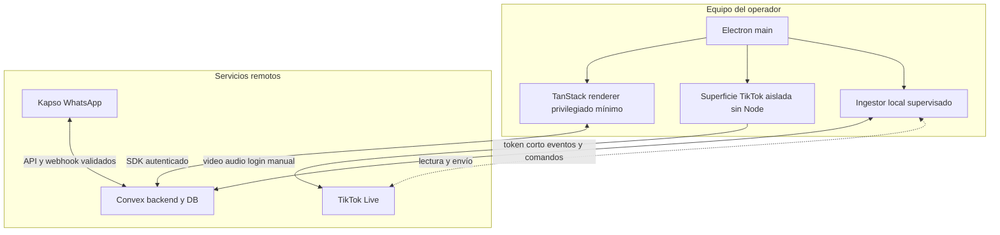

### D2. Registro e inicio de sesión

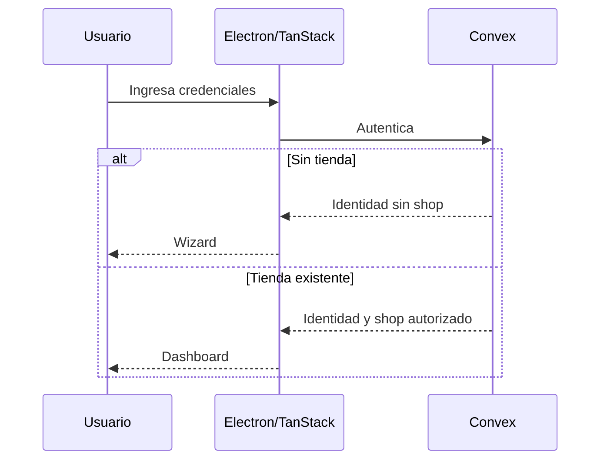

### D3. Wizard

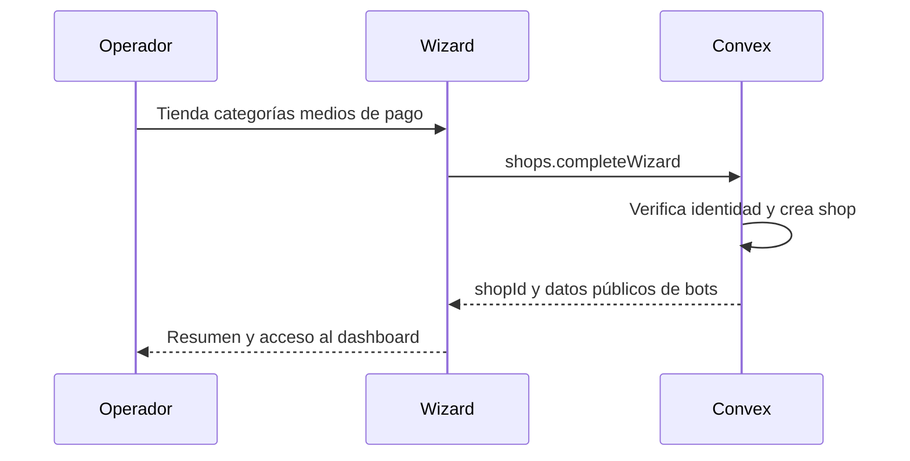

### D4. Dashboard inicial

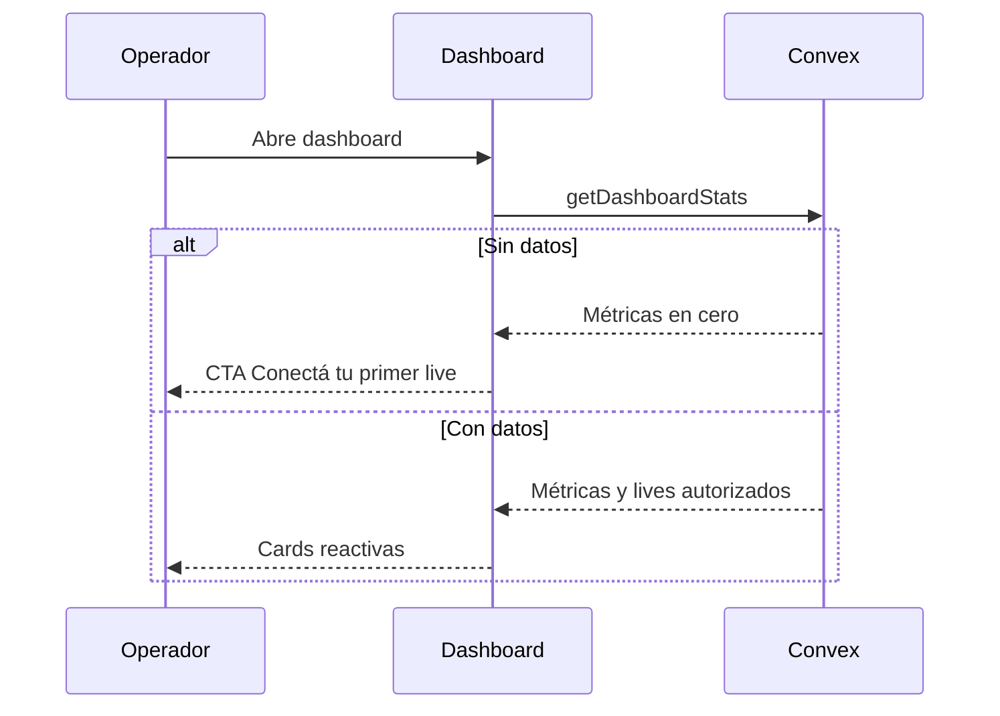

 ### D5. Conexión local a live

 ```mermaid
   sequenceDiagram
     participant U as Operador
     participant E as Electron
     participant C as Convex
     participant I as Ingestor local
     participant T as TikTok
     U->>E: Pega URL y conecta
     E->>C: startLocalSession
     C-->>E: liveId y credencial corta
     E->>I: Arranca proceso con alcance del live
     I->>C: Autentica y heartbeat
     E->>T: Abre superficie aislada
     U->>T: Login manual
     Note over U,I: El login visual no autentica al ingestor
     I-->>T: Conecta 
 ```

 ### D6. Captura de lead

 ```mermaid
   sequenceDiagram
     participant L as Lead
     participant T as TikTok
     participant I as Ingestor
     participant C as Convex
     participant K as Kapso
     participant E as Dashboard
     L->>T: Comenta intención
     T-->>I: Evento si lectura aprobada
     I->>C: ingestEvents con idempotency key
     C->>C: Busca o crea lead
     C->>C: Actualiza productos y cantidades solicitados
     C-->>E: Reflejo en tiempo real por lead
     alt Tiene WhatsApp
       C->>K: Pregunta si conserva número
     else Sin WhatsApp y envío TikTok aprobado
       C-->>I: Comando de invitación
       I-->>T: Envía invitación
     else Envío no aprobado
       C-->>E: Acción manual sugerida
     end
     C-->>E: Fila reactiva
 ```

### D7. WhatsApp y comprobante

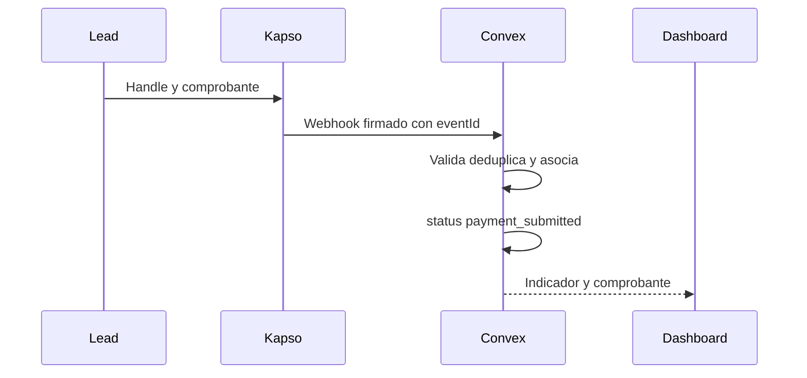

### D8. Validación de pago

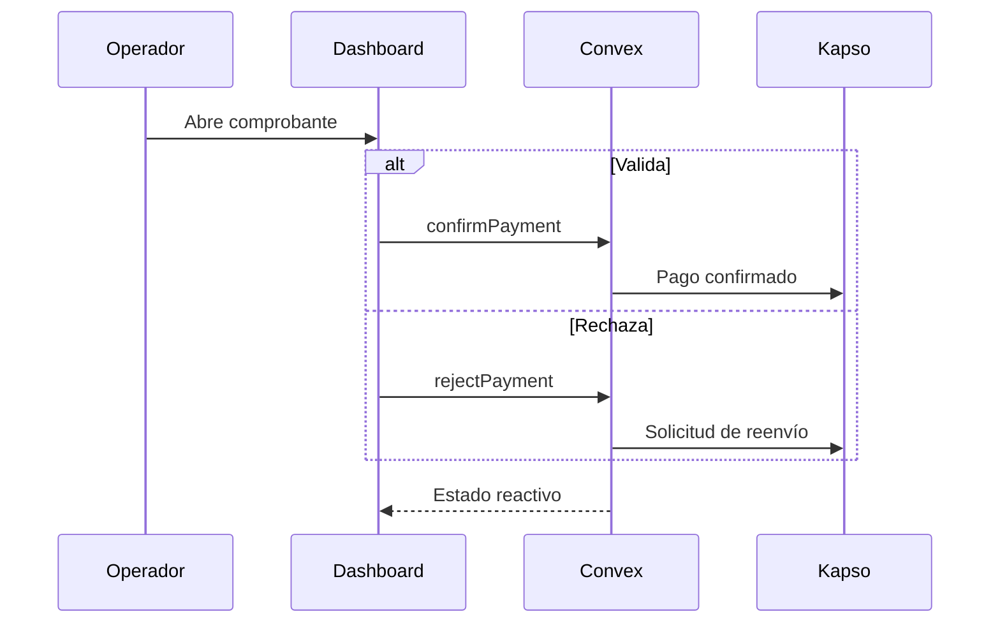

### D9. Carrito WhatsApp

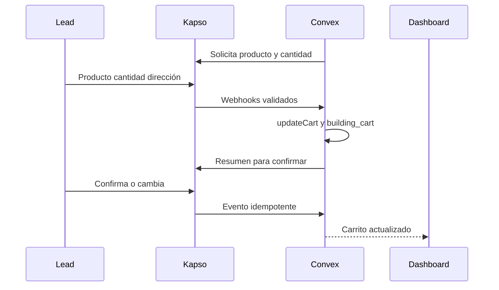

### D10. Productos

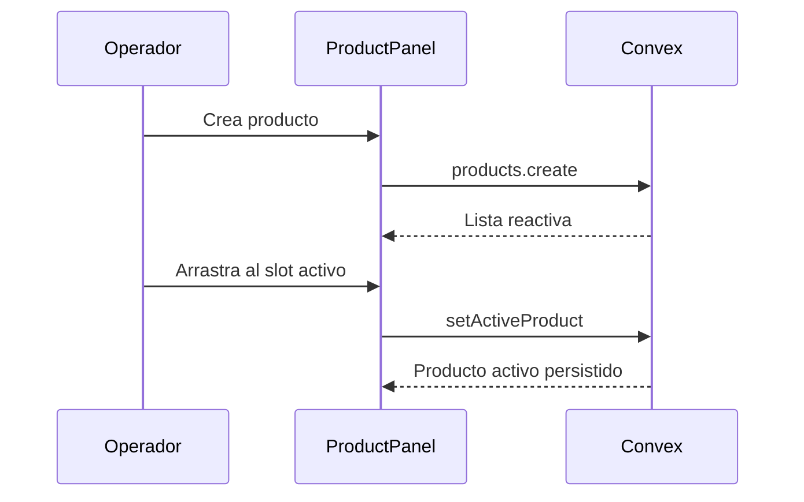

### D11. Cierre local y del live

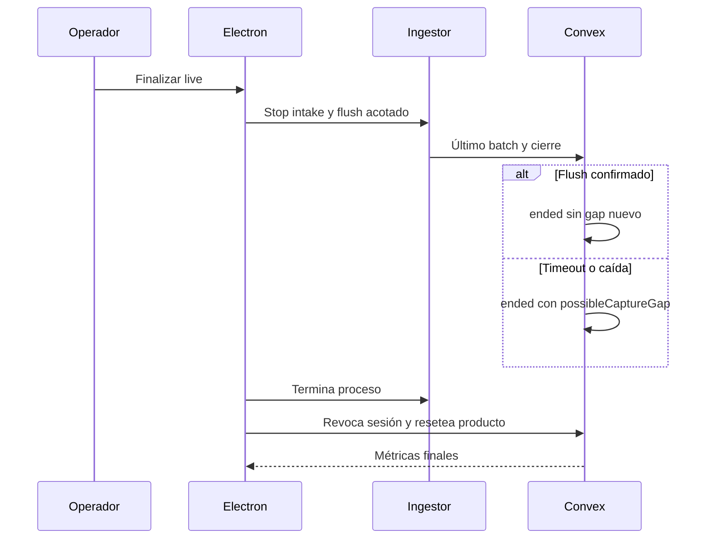

### D12. Reconexión y brecha

 ```mermaid
   sequenceDiagram
     participant E as Dashboard
     participant I as Ingestor
     participant C as Convex
     participant T as TikTok
     T-->>I: Red o canal cerrado
     I->>C: Estado reconnecting si hay red
     loop Backoff con jitter
       I-->>T: Reintenta
     end
     alt Reconecta
       I->>C: Renueva lease y continúa secuencia
       C->>C: Deduplica eventos ya persistidos
       C-->>E: Connected y ventana de gap posible
     else Heartbeat expira
       C->>C: disconnected possibleCaptureGap true
       C-->>E: Advertencia visible
     end
 ```

### D13. Configuración post-wizard

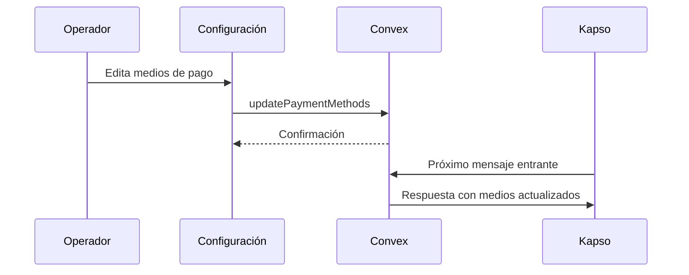

### D14. Notificación al vendedor

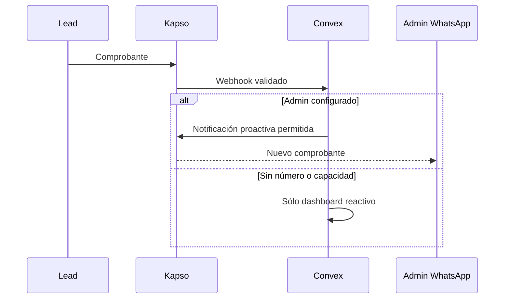

### D15. Producto activo y notificaciones

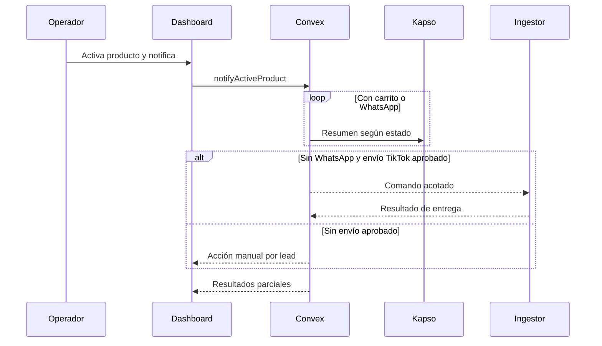

### D16. Cierre de pedidos

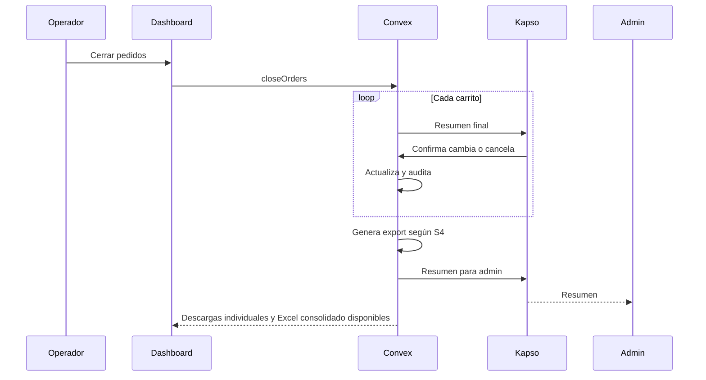

### D17. Seguimiento post-live

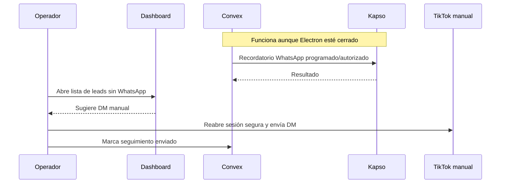

### D18. Máquina de estados

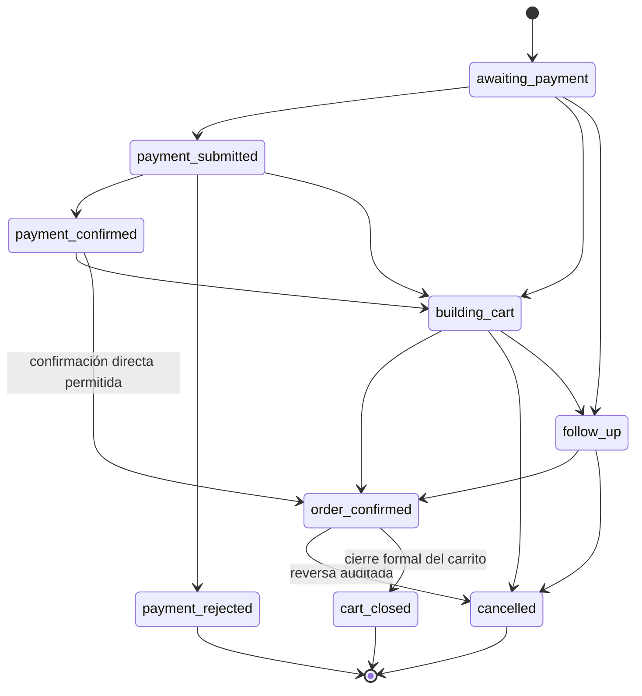

### D19. Arquitectura multitenant

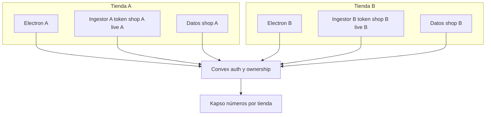

**Principios de aislamiento:** todas las entidades incluyen `shopId`; Convex deriva y verifica ownership desde identidad; cada sesión de ingestor está limitada a un live y tiene expiración/epoch; las tiendas no reciben secretos globales ni datos cruzados; Kapso se vincula a la tienda mediante configuración verificada.

---

## Consideraciones de arquitectura detalladas

### Desktop Electron + TanStack

Responsabilidades: dashboard, visor local, lifecycle, supervisor del ingestor y experiencia offline. No es autoridad final de negocio. El contenido remoto se ejecuta separado del renderer de producto. La UI compartida se comunica con Convex y consume capacidades mediante adaptadores; sólo el adaptador Electron accede a una API preload mínima, nunca a filesystem/shell arbitrarios.

### Convex remoto

Mantiene esquema, transacciones, realtime, authz, sesiones del ingestor, webhooks, facturación y seguimiento. Sus endpoints autentican caller, derivan tenant, validan input y deduplican eventos. Las credenciales administrativas permanecen sólo en entornos remotos apropiados.

### Ingestor local

Es un ejecutable autónomo, explícito y visible, supervisado localmente por la app en este MVP; su núcleo no depende de Electron. No depende de la cookie visual por defecto. Envía eventos normalizados y recibe comandos limitados. Su buffer, si se aprueba, es acotado, cifrado y borrable. Al cerrar la app deja de capturar; suspensión/offline puede causar huecos.

### Kapso remoto

Número por tienda según modelo aprobado; flujos de bienvenida, pago, carrito, confirmación y seguimiento. Todas las formas de API quedan detrás de un adaptador y sujetas a spike. El seguimiento remoto no depende del desktop.

### Distribución

H1 declara Windows como objetivo de acceso; no se certifican todavía distribución ni soporte adicional macOS/Linux o formatos de instalador. Firma, notarización, almacenamiento seguro, crash reporting, actualizaciones y soporte se decidirán con evidencia de S1/S5 y requisitos de producto.

---

## Decisiones consolidadas

| Decisión | Estado |
|---|---|
| Electron para experiencia de escritorio y audio local | Aprobada |
| Ejecutable ingestor autónomo, inicialmente supervisado localmente con la app | Aprobada |
| Frontend único con adaptadores de plataforma y meta ≥90% compartido | Obligatorio; porcentaje sin medir |
| Web responsive de productos/eventos sin visor y operación cloud independiente | Futuras; implementación y verificación diferidas |
| Convex como backend remoto y fuente de verdad | Conservada |
| Kapso como WhatsApp remoto | Conservada |
| Pagos confirmados por administrador | Conservada |
| Producto activo, carrito, cierre, factura y seguimiento | Conservados |
| Seguimiento WhatsApp independiente del desktop | Requerido |
| Librería TikTok -> tiktok-live-api | Aprobada |
| Node versus Bun y estrategia de packaging | Pendiente |
| OS, instalador, firma y updates | Pendiente |

---

**Fin del documento.**
